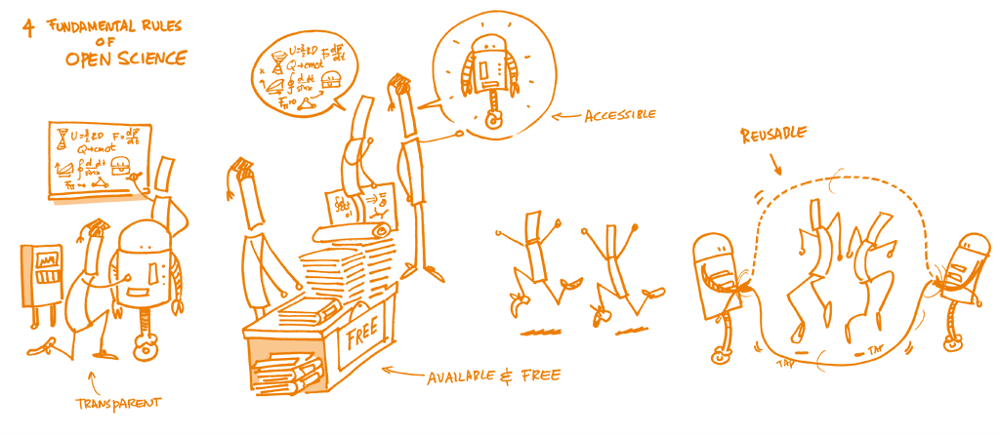

<!-- Markdown emphasis workaround (https://github.com/ramnathv/slidify/issues/224) -->

<!-- ADD  into the <head> of each template or page that you want to use Font Awesome on.

OR

Copy the entire /webfonts folder and the /css/all.css into your project’s static assets directory. The /css/all.css file contains the core styling plus all of the icon styles that you’ll need when using Font Awesome. The /webfonts folder contains all of the typeface files that the above CSS references and depends on. Add a reference to the copied /css/all.css file into the <head> of each template or page that you want to use Font Awesome on. -->

<!-- Slidify (https://github.com/ramnathv/slidify)
## Install
    library(devtools)
    install_github('ramnathv/slidify')
    install_github('ramnathv/slidifyLibraries')
## Initialize - creates a slide directory, initializes it as a git repo and opens index.Rmd for users to edit
    library(slidify)
    author('OpenScience_1_lecture')
## Author
    Write your presentation in RMarkdown editing the index.Rmd file
## Generate
    slidify('index.Rmd', options = list(framework = "io2012", copy_libraries = TRUE))
## Publish to GitHub
    publish(user = USER, repo = REPO) -->

<!-- Learning objectives (FOSTER):

    Understand the social, economical, legal, and ethical principles and concepts underpinning Open Science.

    Become familiar with the history of Open Science, and the disparity and diversity of views from different research communities, disciplines and cultures.

    Gain insight into the developments around Open Science, and the personal impact these can have on researchers, research, and society more broadly. -->

--- .class #id &twocol w1:50% w2:50%
## Introducing myself

*** =left

</img>

*** =right

I am a research/technician [[ORCID](https://orcid.org/0000-0003-1438-4036)] at the [Senckenberg Centre for Human Evolution and Palaeoenvironment](https://www.senckenberg.de/en/institutes/shep/) in Tübingen and an adjunct lecturer at the [University of Tübingen, WG Palaeoanthropology](https://uni-tuebingen.de/en/fakultaeten/mathematisch-naturwissenschaftliche-fakultaet/fachbereiche/geowissenschaften/arbeitsgruppen/prehistory-archaeology-science/research-department/wg-palaeoanthropology/). My main research interest lies in the study of archaeological site formation processes through spatial analysis. I am specialized in computer applications and quantitative methods for archaeological research. I am active in international archaeological research projects. I am also interested in techniques and methods for reproducible research and open science.

--- .class #id &twocol w1:50% w2:50%
## My contacts

### Course communications
* Email: _domenico.giusti@uni.tuebinge.de_

*** =left
### Open research platforms
* My [OSF](https://osf.io/bfa9e/) profile
* [Zenodo](https://zenodo.org/)
  - 
  - 
  - 
* My [GitHub](https://github.com/dncgst) profile

*** =right
### Social networking platforms
* My [RG](https://www.researchgate.net/profile/Domenico-Giusti) profile
* My [Academia](https://uni-tuebingen.academia.edu/domenicogiusti) profile (not maintained)

<!-- * My [Google Scholar](https://scholar.google.com/citations?user=UgWkiroAAAAJ) profile -->

--- .class #id

</img>

Source: [.](https://poliflash.polito.it/ricerca_e_innovazione/l_europa_accelera_sull_open_science)

--- .class #id
## 1. Open Concepts and Principles
### Outline

* Course syllabus
* Definitions
* Rationale
* Summary
* FAQ
* Food for thought
* Practical exercises

<!-- Course syllabus -->

---{class: [segue, dark]}
## Course syllabus

--- .class #id
## Associated course of studies

**Bachelor Ur- und Frühgeschichtliche Archäologie und Archäologie des Mittelalters / Paläoanthropologie**
* 5 enrolled students

**Master Naturwissenschaftliche Archäologie**
* 6 enrolled students

\+ 2 (**Bachelor Geowissenschaften**, **Master English Linguistics**)

--- .class #id
## Teaching methods

### Lecture
Aufgrund der Covid Pandemie findet die Veranstaltung online recorded statt, Unterrichtsmaterialien finden Sie auf Ilias.

Due to the covid pandemic, the course will take place online recorded, material will be uploaded on Ilias on a weekly basis.

### Exercise
Aufgrund der Covid Pandemie findet die Veranstaltung online live via Zoom statt.

Due to the covid pandemic, the course will take place online live via zoom.

--- .class #id
## Requirements

The course has NO specific prerequisites. NO background knowledge or programming skills are expected.

Technical requirements: Regardless of your platform (Windows, Mac or Linux) you will need a high-speed Internet connection in order to watch the videos, download data and software, submit your assignments. You will also need to be able to install software on your PC. BTW, This course makes exclusively use of free and open source software.

--- .class #id &twocol w1:50% w2:50%
## Learning objectives

*** =left

* Learn guiding principles of Open Science:
  - Open Data
  - Open Source
  - Open Methods
  - Open Access
  - Open Peer-review
  - Open Educational Resources
* Understand the ethical, legal, social, economic, and research impact arguments for and against Open Science
* Understand EU and publishing policies

*** =right
* Learn some of the best practices of Open Science:
  - R programming
  - Writing dynamic documents with (R)markdown
  - Version control system with GitHub
  - Pre-print & data publishing

--- .class #id
## Programme

| **Week**    | **Module**                                                     |
|-------------|----------------------------------------------------------------|
| 1 (26 Apr.) | 1. Open Concepts and Principles |
| 2 (3 May)   | 2. Open Research Data |
| 3 (10 May)  | 3. Open Research Software and Open Source |
| 4 (17 May)  | 4. Reproducible Research and Data Analysis |
| Pfingsten BREAK  | --- |
| 5 (31 May)  | Guest lecture (B. Marwick) |
| 6 (7 Jun.)  | 5. Open Access to Published Research Results |
| 7 (14 Jun.) | 6. Open Licensing and File Formats |
| 8 (21 Jun.) | 7. Collaborative Platforms |
| 9 (28 Jun.) | 8. Open Peer Review, Metrics, and Evaluation |
| 10 (5 Jul.) | 9. Open Science Policies |
| 11 (12 Jul.)| 10. Citizen Science |
| 12 (19 Jul.)| 11. Open Educational Resources  |
| 13 (26 Jul.)| Wrap-up & Final exam  |

--- .class #id
## Assignments

* ~~Quizzes (Modules 1 - 11)~~
* swirl modules (15)
* ~~Final exercise~~
* Final exam

--- .class #id
## Course resourses

A growing list of resourses is uploaded on ILIAS.

<!-- Pre-course survey -->

--- .class #id
## Pre-course survey

* Why are you doing the course? Which goals do you want to achieve?
* What is your level of prior knowledge in this course's subject area?
* Do you already have programming skills?

Please complete the [pre-course survey](https://www.surveymonkey.com/r/269K2MF).

<!-- Definitions -->

---{class: [segue, dark]}
## Definitions

--- .nobackground .quote
## What is Open?

<q>Open means anyone can *freely* **access**, **use**, **modify**, and **share** for any purpose (subject, at most, to requirements that preserve provenance and openness)</q>

[Open Definition](https://opendefinition.org/)

--- .class #id
## What is Open?

"The Open Definition was initially derived from the **Open Source Definition**, which in turn was derived from the original **Debian Free Software Guidelines**, and the **Debian Social Contract** of which they are a part, which were created by Bruce Perens and the Debian Developers. Bruce later used the same text in creating the Open Source Definition. This definition is substantially derivative of those documents and retains their essential principles. **Richard Stallman** was the first to push the ideals of software freedom which we continue."

[Open Definition](https://opendefinition.org/)

--- .class #id
## What is Free?

</img>

[R. Stallman by Gisle Hannemyr - CC BY-SA 2.0](https://en.wikipedia.org/wiki/Richard_Stallman#/media/File:Richard_Stallman_by_gisleh_01.jpg)

--- .class #id
## What is Free?

"Free software means software that respects users' freedom and community. Roughly, it means that the users have the freedom to **run**, **copy**, **distribute**, **study**, **change** and **improve** the software. Thus, “free software” is a matter of liberty, not price. To understand the concept, you should think of “free” as in “free speech,” not as in “free beer”. We sometimes call it “libre software,” borrowing the French or Spanish word for “free” as in freedom, to show we do not mean the software is gratis."

[Free Software Foundation](https://www.gnu.org/philosophy/free-sw.html)

--- .class #id
## The 4 essential freedoms

A program is free software if the program's users have the four essential freedoms:

* The freedom (0) to **run** the program as you wish, for any purpose
* The freedom (1) to **study** how the program works, and **change** it so it does your computing as you wish. *Access* to the source code is a precondition for this.
* The freedom (2) to **redistribute** copies so you can help others.
* The freedom (3) to **distribute** copies of your modified versions to others. By doing this you can give the whole community a chance to benefit from your changes. *Access* to the source code is a precondition for this.

[Free Software Foundation](https://www.gnu.org/philosophy/free-sw.html)

--- .class #id
## Free VS Proprietary software

</img>

--- .class #id
## What is Open Science?

"The movement to make scientific research (including publications, data, physical samples, and software) and its dissemination accessible to all levels of an inquiring society, amateur or professional. Open science is **transparent** and **accessible** knowledge that is **shared** and **developed** through **collaborative networks**. It encompasses practices such as publishing open research, campaigning for open access, encouraging scientists to practice open-notebook science, and generally making it easier to publish and communicate scientific knowledge."

[Wikipedia Open Science Definition](https://en.wikipedia.org/wiki/Open_science)

"Open Science is the practice of science in such a way that others can **collaborate** and **contribute**, where research data, lab notes and other research processes are **freely available**, under terms that enable **reuse**, **redistribution** and **reproduction** of the research and its underlying data and methods."

[FOSTER Open Science Definition](https://www.fosteropenscience.eu/foster-taxonomy/open-science-definition)

--- .class #id
## The 4 foundamental rules of Open Science

</img>

[The Open Science Training Handbook](https://book.fosteropenscience.eu)

--- .class #id  &twocol w1:50% w2:50%

*** =left
## Free Software
### The 4 essential freedoms

* The freedom (0) to **run** the program as you wish, for any purpose
* The freedom (1) to **study** how the program works, and **change** it so it does your computing as you wish. *Access* to the source code is a precondition for this.
* The freedom (2) to **redistribute** copies so you can help others.
* The freedom (3) to **distribute** copies of your modified versions to others. By doing this you can give the whole community a chance to benefit from your changes. *Access* to the source code is a precondition for this.

*** =right
## Open Science
### The 4 foundamental rules

* Transparent
  - TRANSPARENCY is a precondition for looking inside, for studying the inner mechanism. It is a precondition for REPRODUCIBILITY
* Available & free
* Accessible
* Reusable

--- .class #id
## Open Science basic principles

</img>

[Gallagher et al. 2020](https://doi.org/10.1038/s41559-020-1109-6)

--- .class #id

</img>

[Pontika et al. 2015](https://doi.org/10.1145/2809563.2809571)

--- .class #id
## Schools of thought

</img>

[Fecher & Friesike 2013](http://dx.doi.org/10.2139/ssrn.2272036)

--- .class #id .quote
## The origin and the future of science

<q>Openness in science is significant in that it both defines the origins   of   modern   science   and   imagines   the   future   of   science.</q>

[Fecher & Friesike 2013](http://dx.doi.org/10.2139/ssrn.2272036)

<!-- Rationale -->

---{class: [segue, dark]}
## Rationale

--- .class #id

</img>

[The Open Science Training Handbook](https://book.fosteropenscience.eu/)

--- .class #id
## Research integrity

</img>

[Munafò et al. 2017](https://doi.org/10.1038/s41562-016-0021)

--- .class #id
## Research integrity

Bias can be introduced throughout the research process by

* Research misconduct (making up data or results, selective reporting, cherry picking...),
* Errors (statistical reporting errors),
* Inconsistencies (results do not match the data generating process),
* HARKing (Hypothesizing After the Results are Known),
* Publication bias (published literature is systematically unrepresentative of the real population of completed studies, e.g., preference to publish positive results or to reject negative results, cooking/writing up mixed results or non-significant results).

> Challenge all steps of your research (research question/hypothesis, study design, data sourcing, processing, analysis, report)!

--- .class #id
## Research integrity

* **Apophenia**: the tendency to see patterns in random data
* **Confirmation bias**: the tendency to focus on evidence that is in line with our expectations or favoured explanation
* **Hindsight bias**: the tendency to see an event as having been predictable only after it has occurred

[Munafò et al. 2017](https://doi.org/10.1038/s41562-016-0021)

--- .class #id
## Research integrity

"A research finding is less likely to be true when the studies conducted in a field are smaller; when effect sizes are smaller; when there is a greater number and lesser preselection of tested relationships; where there is greater flexibility in designs, definitions, outcomes, and analytical modes; _when there is greater financial and other interest and prejudice; and when more teams are involved in a scientific field in chase of statistical significance_."

[Ioannidis 2005](https://doi.org/10.1371/journal.pmed.0020124)

--- .class #id
## Motivations

* Increased TRANSPARENCY can reduce fraud, data manipulation, and selective reporting of results
  - Increased transparency for greater efficiency, rigour, accountability, sustainability for future generations, and reproducibility.
* Sharing resources between research disciplines facilitate scientific collaboration
  - Open research outputs are openly licensed in order to maximize re-use while allowing the creator to retain ownership and receive credit for their work.
* Open Science leads to increased impact associated with wider sharing and re-use (e.g., the so-called [open access citation advantage](https://sparceurope.org/what-we-do/open-access/sparc-europe-open-access-resources/open-access-citation-advantage-service-oaca/oaca-list/))
* Pressure from research academies and governments for publicly-funded research to be shared more openly
  - Publicly funded research outputs should be publicly available ([EU's open science policy](https://ec.europa.eu/info/research-and-innovation/strategy/goals-research-and-innovation-policy/open-science_en#the-eus-open-science-policy))
  - Need to drive cultural change in research and amongst researchers
* Open Science could increase trust in science and in the reliability of scientific results.

--- .class #id
### How is Open Science relevant to archaeology?

* "Open Science practices encourage archaeologists to conduct research that is transparent, reusable, and easily accessible (open data and open methods) without financial or copyright barriers (open access)."
* "Open Science practices improve archaeology by increasing transparency and reproducibility in archaeological research. This approach enables archaeologists to more readily and responsibly build on the work of their colleagues, advancing archaeological practice and accelerating discovery. Transparency and reproducibility also enhance the credibility of archaeological research by allowing more complete independent assessment of research findings than is possible with traditional peer review of only research results. Open Science practices promote ethical research by enabling researchers to efficiently demonstrate the chain of reasoning behind their data analysis and expose more of their research workflow to the research community and the public".
* "Community best practices for open science in archaeology facilitate the sharing of methods, data, and results by encouraging researchers to deposit them in trustworthy online repositories. Standardizing research-sharing practices enhances engagement between archaeologists, our collaborators, and the communities we work with, including policymakers and project managers." [Marwick et al. 2017](http://faculty.washington.edu/bmarwick/PDFs/Marwick_et_al_2017_SAA_Record_Sept.pdf)

--- .class #id
## Major challanges to the realization of Open Science

* Number of actors: authors, reviewers, publishing houses, funding bodies, educational institute etc...
  - Authors have to invest a considerable amount of time and effort to make their research reproducible
  - Reviewers have to invest a considerable amount of time and effort to reproduce the reproducible research
  - Publishing houses are reluctant to give up a commercial model that has been very successful for them in favour of a model that is relatively untested and probably less lucrative.
  - Funding bodies have to foster Open Science by networking with all actors
  - Education institute have to invest resources to develop Open Science curricula and institutional repositories or alternative strategies

--- .class #id
## Major challanges to the realization of Open Science

* Licensing and copyright issues
  - Sensitive data
  - Data ownership - authors hardly understand that, typically, open research outputs are openly licensed in order to maximize re-use while allowing the creator to retain ownership and receive credit for their work.
* Lack of standards, or shared practices
* CULTURAL CHANGE
  - To achieve the necessary cultural change in academia, a new, widely-accepted incentive and reward system for researchers is required.

--- .class #id
## Good news

</img>

This image was created by Scriberia for [The Turing Way](https://the-turing-way.netlify.app/welcome.html) community and is used under a [CC-BY licence](https://creativecommons.org/licenses/by/4.0/)

--- .class #id
## Good news

</img>

[Piwowar et al. 2018](https://doi.org/10.7717/peerj.4375)

<!-- Summary -->

---{class: [segue, dark]}
## Summary

--- .class #id
## Summary

* Definition of Open & how this is related to the free software philosophy
* Definition of Open Science & key values of TRANSPARENCY, ACCESSIBILITY, AVAILABILITY, REPRODUCIBILITY, REUSABILITY
* Open Science basic principles & the multiple perspectives of approaches
  - Open Data
  - Open Source
  - Open Methods
  - Open Access
  - Open Peer-review
  - Open Educational Resources
* Research process, Motivation & major challanges

<!-- FAQ -->

---{class: [segue, dark]}
## FAQ

--- .class #id

__What is the difference between Open Science and ‘science’?__

Open Science refers to doing traditional science with more transparency involved at various stages, for example by openly sharing code and data. Many researchers do this already, but don’t call it Open Science.

__Does ‘Open Science’ exclude the Humanities and Social Sciences?__

No, the term Open Science is inclusive. Indeed, the case is that sometimes Open Science is more broadly referred to as ‘Open Research’ or ‘Open Scholarship’ to be more inclusive of other disciplines, principles and practices. However, Open Science is a commonly used term at multiple levels and so it makes sense to adopt it for communication purposes, with the proviso that it includes all research disciplines.

__Does Open Science lead to misuse or misunderstanding of research?__

No, the application of Open Science principles is in fact a safeguard against misuse or misunderstanding. Transparency breeds trust, confidence and allows others to verify and validate the research process.

--- .class #id

__Will Open Science lead to too much information overload?__

It is better to have too much information and deal with it, than to have too little and live with the risk of missing the important parts. And there are technologies such as RSS feeds, machine learning and artificial intelligence that are making content aggregation easier.

<!-- Food for thought -->

--- .class #id
## Food for thought

What is the current application of Open Science principles in your institute? Picture the positive outcomes that Open Science might have on your current academic life.

<!-- References & Further resources -->

--- .class #id
## References & further resources

### Reading list

* Marwick et al. 2017. [Open science in archaeology](https://osf.io/preprints/socarxiv/72n8g/). SAA Archaeological Record

### References & further resources

* [Fecher & Friesike 2013](http://dx.doi.org/10.2139/ssrn.2272036)
* [Gallagher et al. 2020](https://doi.org/10.1038/s41559-020-1109-6)
* [Ioannidis 2005](https://doi.org/10.1371/journal.pmed.0020124)
* [Munafò et al. 2017](https://doi.org/10.1038/s41562-016-0021)
* [Piwowar et al. 2018](https://doi.org/10.7717/peerj.4375)
* [Pontika et al. 2015](https://doi.org/10.1145/2809563.2809571)
 
 
[Opening Science. The Evolving Guide on How the Internet is Changing Research, Collaboration and Scholarly Publishing](https://doi.org/10.1007/978-3-319-00026-8) - ([Dynamic version](http://book.openingscience.org.s3-website-eu-west-1.amazonaws.com/))

<!-- Practical exercises -->

---{class: [segue, dark]}
## Practical exercises

--- .class #id
## Practical exercises
### Outline

* Introduction to some of the best tools for doing Reproducible Research
  - R & RStudio
  - (R)Markdown
  - Git & GitHub
  - Zenodo, OSF

### Setup

Download and install the [R base system](https://cran.rstudio.com/) and [RStudio](http://www.rstudio.com/products/rstudio/download/). Both are needed. Installing RStudio will not automatically install R.
