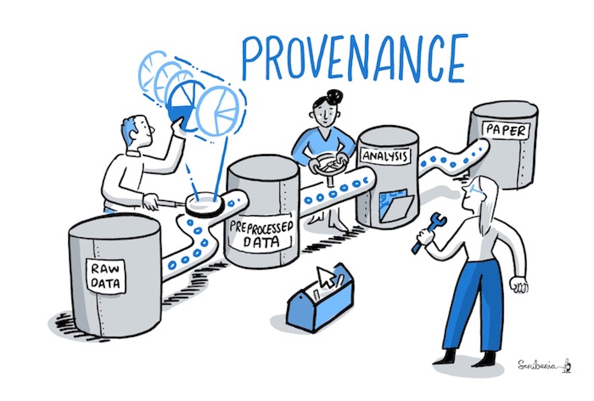

<!-- Markdown emphasis workaround (https://github.com/ramnathv/slidify/issues/224) -->

<style>
em {
  font-style: italic
}
</style>

<style>
strong {
  font-weight: bold;
}
</style>

## Week 3: Open Research Software and Open Source
### Outline

* Git & GitHub workflow
  - Create a repository on GitHub & link it to RStudio
  - Write a README.md file
  - Choose and apply a license for your repository/R code
      - [Licensing a GitHub repository](https://docs.github.com/en/github/creating-cloning-and-archiving-repositories/licensing-a-repository)
  - commit & push

<!-- Recap week 2 -->

---{class: [segue, dark]}
## Recap week 2

--- .class #id
## Recap week 2

* Create an RStudio project
* Organization of a research project repository (`/data`, `/figures`, `/src`, `/doc`, `README`, `LICENSE`)
* Read data (CSV file) from Dropbox
* `View()`, `str()` and `summary()` functions
* Structure of tidy data frame
* RMarkdown example

--- .class #id
## swirl modules (week 2)
### 3. Sequences of Numbers

* Create a sequence by using
  - the `:` operator
  - the `seq()` and the `seq_along()` functions
  - the `rep()` function
* `length()` function

> "Simple approaches that involve less typing are generally best".

> "It's also important for your code to be readable, so that you and others can figure out what's going on without too much hassle."

--- .class #id
## swirl modules (week 2)
### 4. Vectors

* (atomic) vector is the most common data structure in R, containing one type of data (numeric, logical, character, integer, complex)
* logical operators: `>`, `>=`, `<`, `<=`, `==`, `!=`
* logical operators: `|`, `&`, `!`
* `paste()` function

--- .class #id
## Assignments (week 3)

Complete swirl modules '5: Missing Values' and '6: Subsetting Vectors' and submit your successful completion via email (domenico.giusti@uni-tuebingen.de)

> **swirl modules won't count towards your final grade but are highly recommended to follow. Those topics will be covered on the final exam.**

---{class: [segue, dark]}
## Git & GitHub basic workflow

--- .class #id

</img>

---
## Assignments (week 1)

If you don't have it already, now might be a good time to **install Git and sign up on GitHub** to get started.

### Git

* Download and install [Git](https://git-scm.com/)
  - Windows https://git-scm.com/download/win
  - Mac https://git-scm.com/download/mac
  - GNU/Linux https://git-scm.com/download/linux

(Git is a command line program. Do not install any GUI client)

### GitHub

* Create an account on [GitHub](https://github.com)
* Send your username to your [instructor](https://github.com/dncgst)

--- .class #id
## What are Git & GitHub?

* Git is a version control system
* GitHub is a web-based Git repository hosting service

**Make your work more organised, efficient, collaborative, and reproducible!**

I use both for keeping **track of changes** in manuscripts, presentations, lectures, data and data analysis projects. I use Git mostly as a version control system of my projects, and GitHub for social networking, for exploring others' projects and eventually **contribute** to them. By hosting your repositories, GitHub also works as a cloud **back-up** service.

> RStudio has super simple point-and-click version control (via git) baked in for “projects”. No excuses for not using it! (via @danmcglinn) [@phylorich](https://twitter.com/phylorich/status/301107009573490688)

--- .class #id
## Version controlling code and documents

</img>

[PhD comics](http://phdcomics.com/)

---
## Version controlling data

"If a dataset that is the basis for computing a scientific result changes without version control, reproducibility can be threatened: results may become invalid, or scripts that are based on file names that change between versions can break. Especially if original data gets replaced with new data with no version control in place, the original results of the analysis may not be reproduced." [The Turing Way - Guide for Reproducible Research](https://the-turing-way.netlify.app/reproducible-research/reproducible-research.html)

</img>

This image (and the previous one) was created by Scriberia for [The Turing Way](https://the-turing-way.netlify.app/welcome.html) community and is used under a [CC-BY licence](https://creativecommons.org/licenses/by/4.0/)

---
## What is “version control”, and why should you care?

> Version control is a system that records changes to a file or set of files over time so that you can recall specific versions later.
> Using a version control system (VCS) also generally means that if you screw things up or lose files, you can easily recover.

> In Distributed Version Control Systems (such as Git), clients don’t just check out the latest snapshot of the files; rather, they fully mirror the repository, including its full history. Thus, if any server dies, and these systems were collaborating via that server, any of the client repositories can be copied back up to the server to restore it. Every clone is really a full backup of all the data. [Pro Git book](https://git-scm.com/book/en/v2)

</img>

--- .class #id &twocol w1:40% w2:60%
## What is Git?

*** =left
### Snapshots

"With Git, every time you commit, or save the state of your project, Git basically takes a picture of what all your files look like at that moment and stores a reference to that snapshot. To be efficient, if files have not changed, Git doesn’t store the file again, just a link to the previous identical file it has already stored. Git thinks about its data more like a stream of snapshots." [Pro Git book](https://git-scm.com/book/en/v2)

*** =right
</img>

---
### Local

"Most operations in Git need only local files and resources to operate — generally no information is needed from another computer on your network. [...] Because you have the entire history of the project right there on your local disk, most operations seem almost instantaneous."

"This also means that there is very little you can’t do if you’re offline"

### Integrity

"Everything in Git is checksummed before it is stored and is then referred to by that checksum. This means it’s impossible to change the contents of any file or directory without Git knowing about it. [...] You can’t lose information in transit or get file corruption without Git being able to detect it." [Pro Git book](https://git-scm.com/book/en/v2)

A checksum [SHA-1 hash] looks something like this:

    24b9da6552252987aa493b52f8696cd6d3b00373

--- .class #id &twocol w1:40% w2:60%
### The Three States

*** =left
Git has three main states that your files can reside in: **modified**, **staged**, and **committed**:

* _Modified_ means that you have changed the file but have not committed it to your database yet.
* _Staged_ means that you have marked a modified file in its current version to go into your next commit snapshot.
* _Committed_ means that the data is safely stored in your local database.

[Pro Git book](https://git-scm.com/book/en/v2)

*** =right
</img>

--- .class #id &twocol w1:40% w2:60%
## Basic Git workflow

*** =left
The basic Git workflow goes something like this:

1. You **_modify_** files in your working tree.
2. You selectively **_stage_** just those changes you want to be part of your next commit, which adds only those changes to the staging area.
3. You do a **_commit_**, which takes the files as they are in the staging area and stores that snapshot permanently to your Git directory.

[Pro Git book](https://git-scm.com/book/en/v2)

*** =right
</img>

--- .class #id
## GitHub repository example

[benmarwick/1989-excavation-report-Madjedbebe](https://github.com/benmarwick/1989-excavation-report-Madjedbebe)

Research compendium of data, code, and text associated with the publication: Clarkson et al. 2015. The archaeology, chronology and stratigraphy of Madjedbebe (Malakunanja II): A site in northern Australia with early occupation. Journal of Human Evolution 83, 46–64 http://dx.doi.org/10.1016/j.jhevol.2015.03.014

--> Marwick, B. Computational Reproducibility in Archaeological Research: Basic Principles and a Case Study of Their Implementation. J Archaeol Method Theory 24, 424–450 (2017). https://doi.org/10.1007/s10816-015-9272-9

--- .class #id
## Git w/ RStudio

Good news: RStudio has git built in. Bad news: The set of things you can do with git through RStudio is quite limited, but it might be enough for your need, and, if you’re doing your work there already, it is quite convenient.

### Getting Started

Once you've installed your preferred version control system [git], you'll need to activate it on your system by following these steps:

1. Go to Global Options (from the Tools menu)
2. Click Git/SVN
3. Click Enable version control interface for RStudio projects
4. If necessary, enter the path for your Git or SVN executable where provided. You can also create or add your RSA key for SSH if necessary.

---
## Git w/ RStudio
### Introduce yourself to Git

1. Git tab -> More -> Shell


```r
git config --global user.name "[name]"
git config --global user.email "[email]" # same as GitHub account email
git config --global --list
```

--- .class #id
## Git w/ RStudio
### Start a project in a brand new working directory

1. Click the “File” menu button, then “New Project”
2. Click “New Directory”
3. Click “New Project”
4. Type in the name of the directory to store your project, e.g. “test_rr”
5. **Check "Create a git repository"**
6. Hit the “Create Project” button!

</div>

Now the top right panel has a _Git_ tab!

--- .class #id
## Git w/ RStudio
### Associate a project with an existing working directory

1. Click the “File” menu button, then “New Project”
2. Click "Existing Directory"
3. Browse your project working directory
4. Hit the “Create Project” button!
5. Click the "Tools" menu button, then "Project Options..."
6. Select "Git/SVN" from the menu on the left
7. Version control system: Select "Git" from the dropdown menu

</div>

Now the top right panel has a _Git_ tab!

---
## Git w/ RStudio
### Checkout a project from a version control repository

1. Click the “File” menu button, then “New Project”
2. Click "Version Control"
3. Click "Git (_Clone_ a project from a Git repository)"
4. Type the repository URL: (e.g. https://github.com/benmarwick/1989-excavation-report-Madjedbebe)
5. Type the Project directory name: (e.g., 1989-excavation-report-Madjedbebe)
6. Hit the “Create Project” button!

</div>

Now the top right panel has a _Git_ tab!

---
## Modify, stage & commit w/ RStudio

* Write a README.md file
* Choose and apply a license for your repository/R code
    - [Licensing a GitHub repository](https://docs.github.com/en/github/creating-cloning-and-archiving-repositories/licensing-a-repository)
* Stage
* Commit
  - Commits should be ‘atomic’, meaning that they should do one simple thing and they should do it completely. Avoid to commit a lot of different changes to your project all together!
  - Make the commit message meaningful! Summarise in the first line the changes your commit contains. Then leave a blank line and extensively describe _what you did, why you did it, and what is impacted by the changes_.

---
## Working w/ branches

Advanced version control systems such as Git allow non-linear development of your project with branches. "A branch creates a local copy of the main repository where you can work and try new changes. Any work you do on your branch will not be reflected on your main project (referred to as your master branch) so it remains secure and error-free. [...] When you are happy with the new changes, you can introduce them to the main project." [The Turing Way - Guide for Reproducible Research](https://the-turing-way.netlify.app/reproducible-research/reproducible-research.html)

</img>

Tipical scenario: when you collaborate with others, and everyone works on the master branch simultaneously, there could be a lot of confusion and conflicting changes.

---
## Git Basics - Working with Remotes

So far we’ve worked with a local Git repository...

"Remote repositories are versions of your project that are hosted on the Internet or network somewhere [GitHub]. Collaborating with others involves managing these remote repositories and **pushing** and **pulling** data to and from them when you need to share work." [Pro Git book](https://git-scm.com/book/en/v2)

As research becomes increasingly collaborative and multiple people work on the same project, it becomes difficult to keep track of changes made by others if not done systematically. Moreover, it is time-consuming to manually incorporate the work of different participants in a project, even when all of their changes are compatible. Hosting the project on an online repository hosting service like GitHub is beneficial to make collaborations open and effective.

* `git clone` - create a local copy of an online repository
  - NOTE: the  command implicitly adds the origin remote for you.
* `git pull` (fetch + merge) - update the local version of an online repository or pull other’s work into your copy
* `git push` - push changes to the remote online repository

<!-- References & Further resources -->

--- .class #id
## References & further resources

* [Pro Git book](https://git-scm.com/book/en/v2)
* [Happy Git and GitHub for the useR](https://happygitwithr.com/)
* [The Turing Way - Guide for Reproducible Research](https://the-turing-way.netlify.app/reproducible-research/reproducible-research.html)
* [GitHub Learning Lab](https://lab.github.com/)
