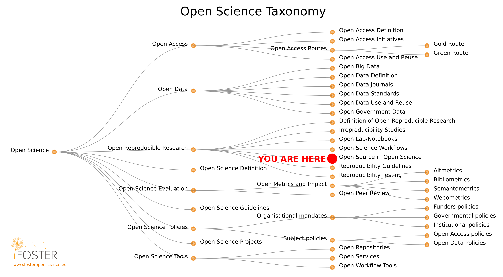
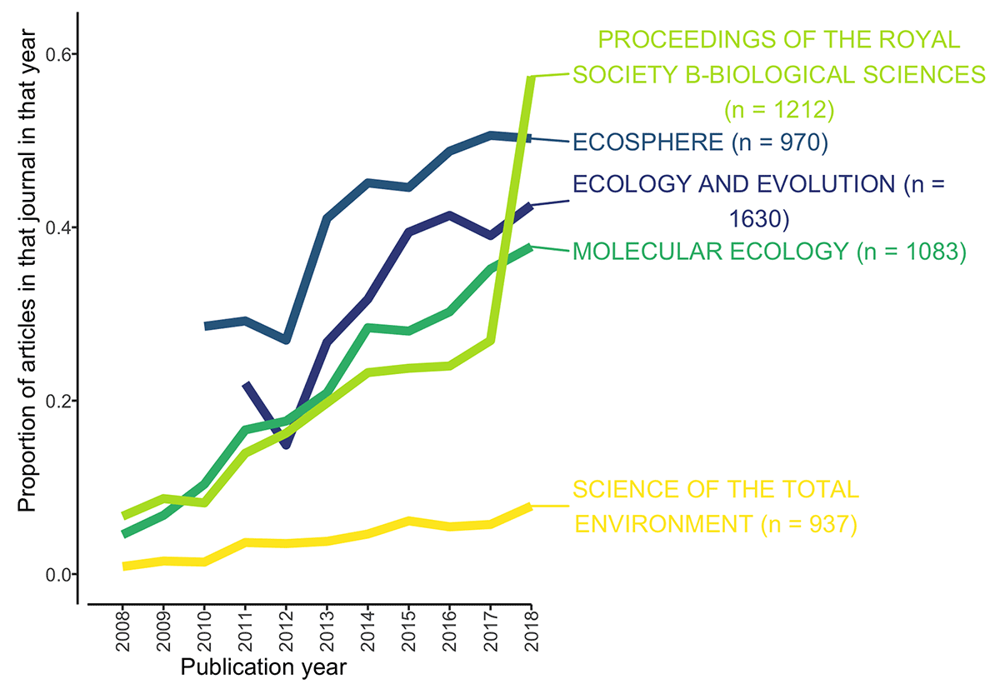
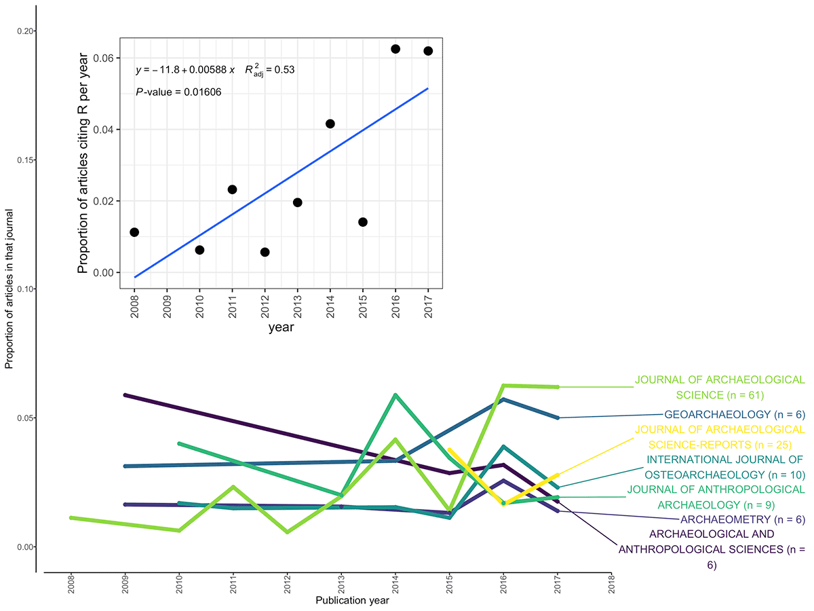
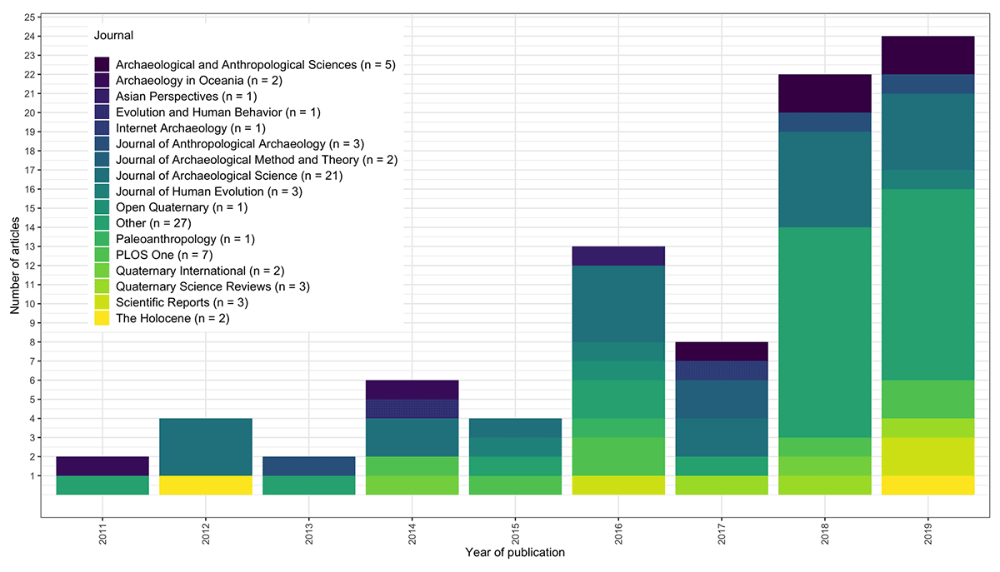
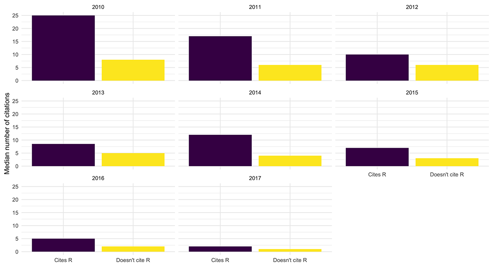
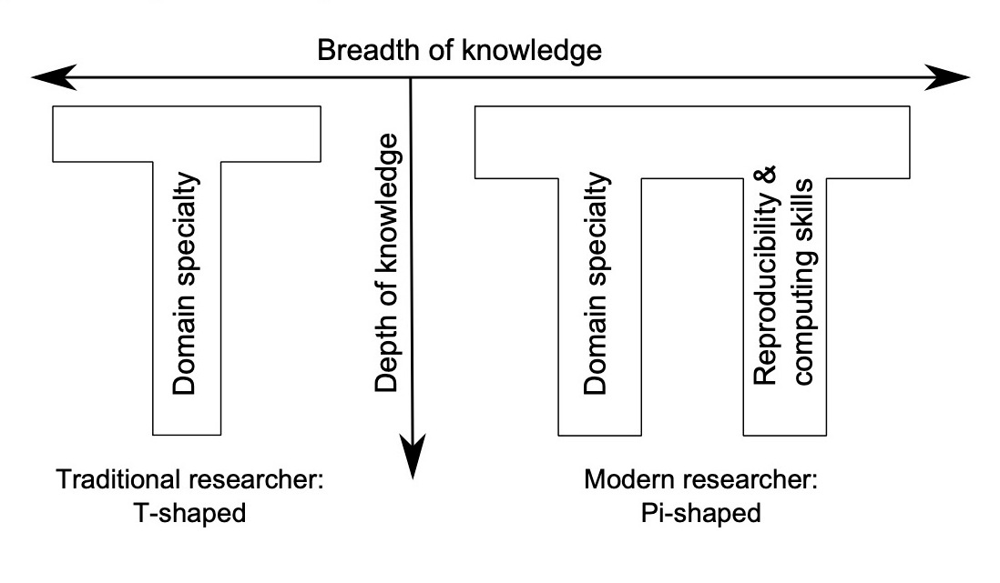
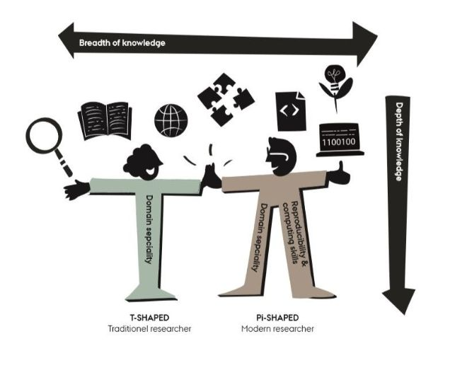
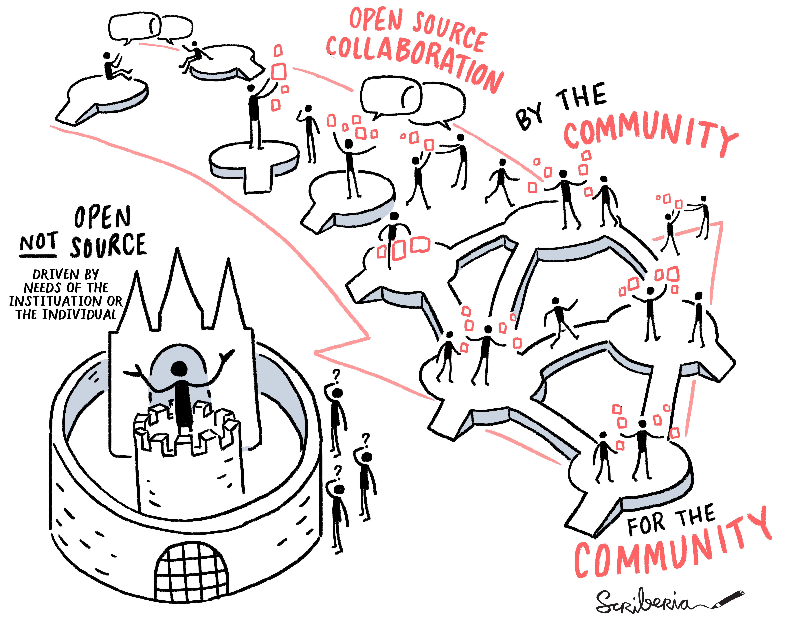
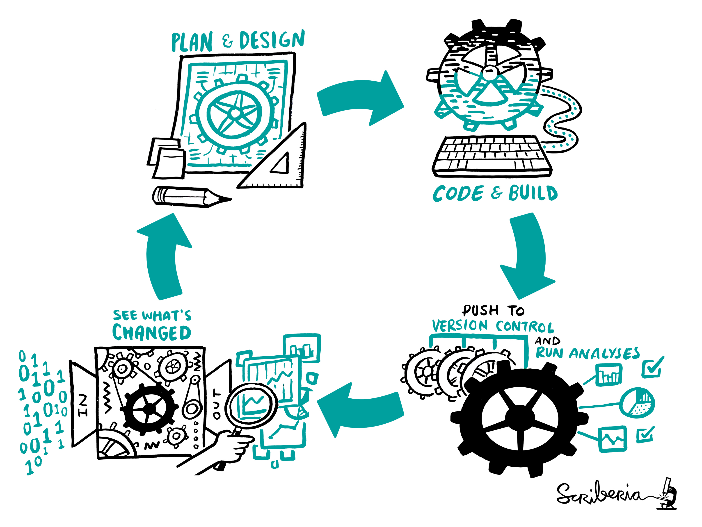

<!-- Markdown emphasis workaround (https://github.com/ramnathv/slidify/issues/224) -->

<!-- Slidify (https://github.com/ramnathv/slidify)
## Install
    library(devtools)
    install_github('ramnathv/slidify')
    install_github('ramnathv/slidifyLibraries')
## Initialize - creates a slide directory, initializes it as a git repo and opens index.Rmd for users to edit
    library(slidify)
    author('OpenScience_2_lecture')
## Author
    Write your presentation in RMarkdown editing the index.Rmd file
## Generate
    slidify('index.Rmd')
## Publish to GitHub
    publish(user = USER, repo = REPO) -->

<!-- Learning objectives (FOSTER):

    Learn the characteristics of open software; understand the ethical, legal, economic, and research-impact arguments for and against open software, and further understand the quality requirements of open code.

    Learn how to use existing open software and appropriately attribute (cite) it.

    Learn how to use common tools and services for sharing research codes openly.

    Be able to choose the appropriate license for their software, and understand the difference between permissive and non-permissive licenses. -->

## Course roadmap

</img>

[Pontika et al. 2015](https://doi.org/10.1145/2809563.2809571)

--- .class #id
## 3. Open Research Software and Open Source
### Outline

* Definitions
* Rationale
* Summary
* FAQ
* Food for thought
* Practical exercises

<!-- Definitions -->

---{class: [segue, dark]}
## Definitions

--- .class #id

<q>Open research software, or open-source research software, refers to the use and development of software for analysis, simulation, visualization, etc. where the full source code is available [and] shared under a license that allows modification, derivation, and redistribution..</q>

* [The Open Science Training Handbook](https://book.fosteropenscience.eu/)

--- .class #id &twocol w1:50% w2:50%

*** =left
### [Free/Libre Software](https://www.gnu.org/philosophy/free-sw.html)
* Freedom (0) to **run** the program as you wish, for any purpose
* Freedom (1) to **study** how the program works, and **change** it so it does your computing as you wish. *Access* to the source code is a precondition for this.
* Freedom (2) to **redistribute** copies so you can help others.
* Freedom (3) to **distribute** copies of your modified versions to others. *Access* to the source code is a precondition for this.

*** =right
### [Open Source Software](https://opensource.org/osd)
* 1. Free Redistribution
* 2. Source Code
* 3. Derived Works
* 4. Integrity of The Author's Source Code
* 5. No Discrimination Against Persons or Groups
* 6. No Discrimination Against Fields of Endeavor
* 7. Distribution of License
* 8. License Must Not Be Specific to a Product
* 9. License Must Not Restrict Other Software
* 10. License Must Be Technology-Neutral

--- .class #id
## FLOSS VS Proprietary software

</img>

---
## FLOSS research software

* "It frees researchers from the black box that most mouse-driven programs are, and enables researchers to not only rerun the shared analysis, but to gain access to all parameter settings, empowering them to change these and so properly evaluate, extend and reuse the published results".
* "As open source languages such as R (and Python) are free to use, and many trustworthy repositories are also free (such as Zenodo, Open Science Framework, Figshare, etc.), then even researchers with limited resources anywhere in the world can contribute equally to the research community by using and sharing code. Using and sharing open source code is thus an important action for reducing inequality in the archaeological research community."

[Schmidt & Marwick 2020](http://doi.org/10.5334/jcaa.29)

<!-- Rationale -->

---{class: [segue, dark]}
## Rationale

--- .class #id
## A tool-driven revolution?

Archaeology is living a tool-driven revolution, or at least a change, in search for a more transparent and reproducible model.

Factors:

* a significant increase in the rate of data collection
* a significant increase in computing power
* a significant development of FLOSS software for data analysis and visualisation
* a shift towards quantitative and computational analyses

--- .class #id &twocol w1:50% w2:50%

*** =left
### Articles citing R in Ecology

</img>

Percentage of articles per year citing R in top Ecology journals (**5,800** articles out of 42,659). Data from Web of Science. [Schmidt & Marwick 2020](http://doi.org/10.5334/jcaa.29)

*** =right
### Articles citing R in Archaeology

</img>

Proportion of Archaeology articles per year citing R (a total of **154** out of 42,991 articles in our sample for 2008–2018). Sub-plot shows articles published in the _Journal of Archaeological Science_ during 2008–2017.

--- .class #id
### Articles sharing R

</img>

Articles in archaeology journals using R for reproducible research, and making code files openly available to accompany the published article (n = 85). [Schmidt & Marwick 2020](http://doi.org/10.5334/jcaa.29)

--- .class #id
### Citation advantage

</img>

Median citation rates per year for archaeology articles 2010–2017 that cite R (n = 216) and articles that do not cite R (n = 42,828). On average, articles citing R have higher numbers of citations (m = 10.1) than articles that do not (m = 6.5), t(158) = 3.38, p = 0.00092. [Schmidt & Marwick 2020](http://doi.org/10.5334/jcaa.29)

--- .class #id
## T- / π-shaped research

</img>

[Marwick 2017](https://doi.org/10.1007/s10816-015-9272-9)

--- .class #id
## T- ~ π-shaped research

</img>

* [Conversations in Human Evolution: Prof. F. Riede](https://conversationsinhumanevolution.com/2020/05/22/conversations-with-professor-felix-riede/)

--- .class #id

</img>

This image was created by Scriberia for [The Turing Way](https://the-turing-way.netlify.app/welcome.html) community and is used under a [CC-BY licence](https://creativecommons.org/licenses/by/4.0/)

---
## The π-shaped research lifecycle

</img>

This image was created by Scriberia for [The Turing Way](https://the-turing-way.netlify.app/welcome.html) community and is used under a [CC-BY licence](https://creativecommons.org/licenses/by/4.0/)

--- .class #id

<q>An article about a computational result is advertising, not scholarship. The actual scholarship is the full software environment, code and data, that produced the result</q> [Buckheit & Donoho 1995](https://doi.org/10.1007/978-1-4612-2544-7_5)

--- .class #id
## Best practices

* Make source code publicly accessible **from day one**
* Make software easy to discover by providing software **metadata** via a popular community registry
* Accompain your code w/ a **license**
  - [Choosealicense.com](https://choosealicense.com/)
  - Release under the [MIT license](https://choosealicense.com/licenses/mit/) to enable maximum reuse
  - How to apply a license? Create a text file (typically named LICENSE or LICENSE.txt) in the root of your source code and copy the text of the license into the file.
* Appropriately cite software used
    - (e.g.) "R Core Team (2021). R: A language and environment for statistical computing. R Foundation for Statistical
    Computing, Vienna, Austria. URL https://www.R-project.org/."
    - citation("pkgname")
* Define clear and transparent contribution, governance and communication processes

[Jiménez et al. 2017](https://doi.org/10.12688/f1000research.11407.1)

--- .class #id
## Cons

* A certain familiarity with the computational tools is required to be able to use them not just on a technological basis, but creatively and in full knowledge of their restrictions and ambiguities

* As with data, preparing code to make it publicly available takes time to ensure that it is fit for others to read and use.

[Schmidt & Marwick 2020](http://doi.org/10.5334/jcaa.29)

<!-- FAQ -->

---{class: [segue, dark]}
## FAQ*

--- .class #id

**I can’t share my [(R) code] — it’s too messy / it doesn’t have good documentation / I didn’t leave good comments!**

Developers of research software around the world empathize with this feeling—people rarely feel like their code is "ready" to publicly share or that it is “finished”. However, as [Barnes (2010)](https://doi.org/10/cj8t6n) put it, “if your code is good enough to do the job, then it is good enough to release — and releasing it will help your research and your field.” In other words, if you feel comfortable enough with your software to publish a study or report results, then the code is sufficiently developed to share with your colleagues. (In the other direction, if you don’t feel comfortable sharing the code, then perhaps it requires more development or testing before using in a publication). Plus, sharing your code allows others to improve and build upon it, leading to even greater impact and innovation (and citations for you!).

**What if someone takes the code I have shared and uses it for nefarious purposes, or claims they wrote it?**

Selecting an appropriate license for your software will help protect you from any uses of your software by others; for example, the common [MIT License](https://choosealicense.com/licenses/mit/) includes both limitations of liability and states that no warranty is provided. If someone else tries to claim that they wrote the software you made available, then you can point to the timestamps on your repository or archived versions as proof of your prior work.

--- .class #id

**If I share my code in an online repository, I will be deluged with requests for user support.**

Although potential users may ask you for help, either via email or (e.g.) issues filed on the online repository, you are under no obligation to provide support if you prefer not to or cannot do so. An appropriate license even provides you with legal protection for this (e.g., the no-warranty clause of the [MIT License](https://choosealicense.com/licenses/mit/)).

\* [The Open Science Training Handbook](https://book.fosteropenscience.eu/)

<!-- Food for thought -->

--- .class #id
## Food for thought

**The primary cost of enhancing reproducibility is the time required to learn to use the software tools.**

"Developing competence in using these tools for enhancing computational reproducibility is time-consuming, and raises the question of how much of this is practical for most archaeologists, and what the benefits and costs might be. Our view is that once the initial costs of learning the tools is paid off, implementing the principles [of RR] makes research and analysis easier, and has material professional benefits [such as citation advantages]." [Marwick 2017](https://doi.org/10.1007/s10816-015-9272-9)

* Should all public Universities teach RR software tools in their Bachelor/Master/PhD programs?

<!-- References & Further resources -->

--- .class #id
## References & further resources

### Reading list

*  Schmidt, S.C. and Marwick, B., 2020. Tool-Driven Revolutions in Archaeological Science. Journal of Computer Applications in Archaeology, 3(1), pp.18–32. DOI: http://doi.org/10.5334/jcaa.29

### References & further resources

* [Conversations in Human Evolution: Prof. F. Riede](https://conversationsinhumanevolution.com/2020/05/22/conversations-with-professor-felix-riede/)
* [Barnes 2010](https://doi.org/10/cj8t6n)
* [Buckheit & Donoho 1995](https://doi.org/10.1007/978-1-4612-2544-7_5)
* [Jiménez et al. 2017](https://doi.org/10.12688/f1000research.11407.1)
* [Marwick 2017](https://doi.org/10.1007/s10816-015-9272-9)
* [Choosealicense.com](https://choosealicense.com/)
* [rOpenSci](https://ropensci.org/)

--- .class #id
## References & further resources

### Open Software Journals

* [Journal of Open Research Software (JORS)](https://openresearchsoftware.metajnl.com/)
* [Nature Toolbox](https://www.nature.com/nature/articles?type=toolbox)
* [PLOS](https://journals.plos.org/plosone/s/materials-software-and-code-sharing)
  - "We expect that all researchers submitting to PLOS submissions in which software is the central part of the manuscript will make all relevant software available without restrictions upon publication of the work."
* [Hong's list](https://www.software.ac.uk/which-journals-should-i-publish-my-software)

<!-- Practical exercises -->

---{class: [segue, dark]}
## Practical exercises

--- .class #id
## Practical exercises
### Outline

* Git & GitHub workflow
  - Create a repository on GitHub & link it to RStudio
  - Write a README.md file
  - Choose and apply a license for your repository/R code
      - [Licensing a GitHub repository](https://docs.github.com/en/github/creating-cloning-and-archiving-repositories/licensing-a-repository)
  - commit & push
