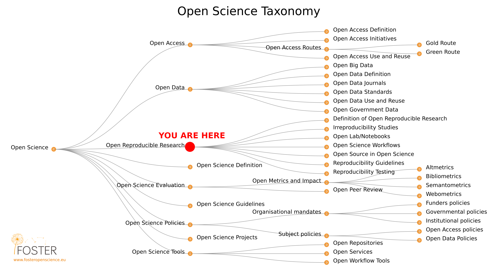
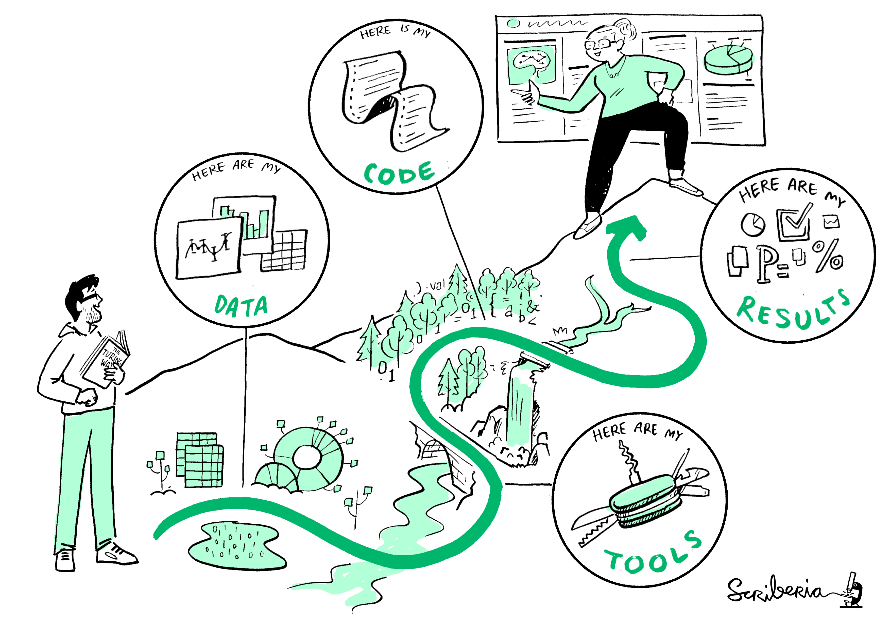
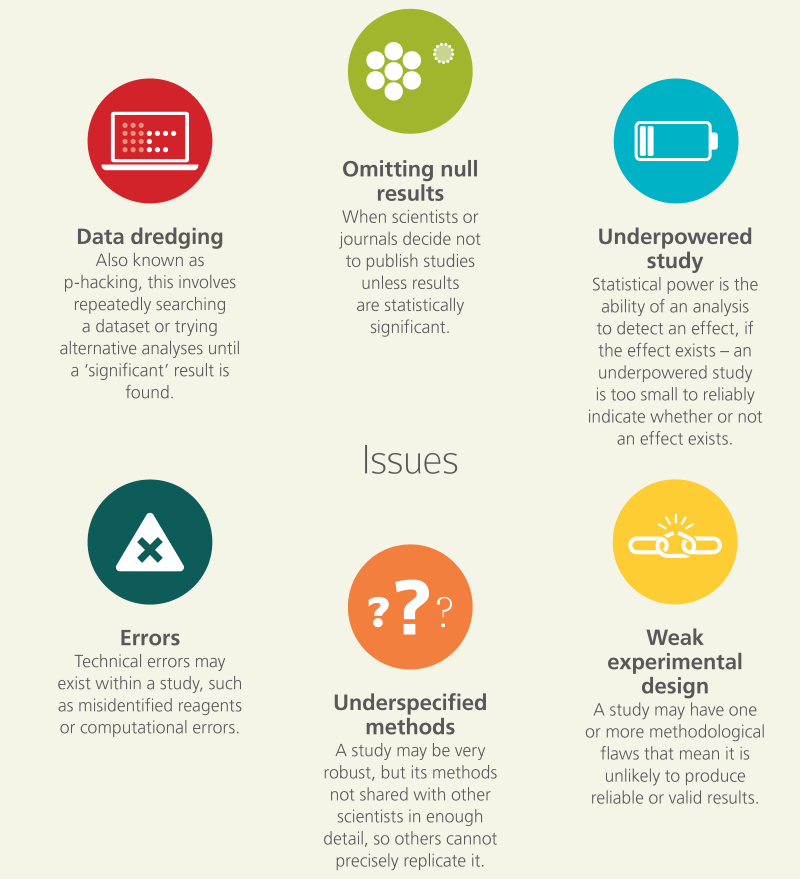
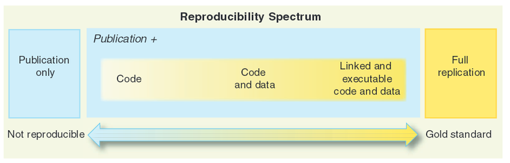
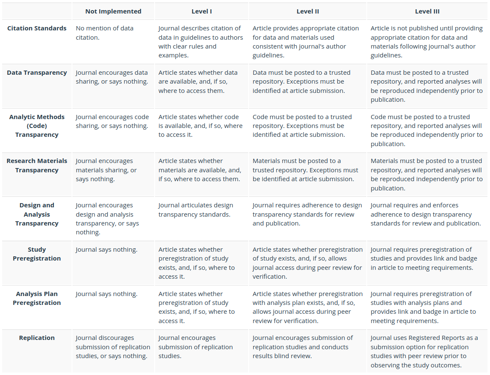
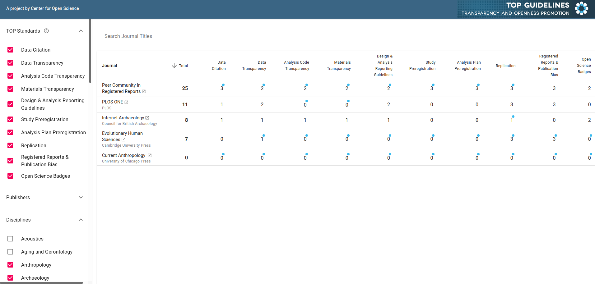
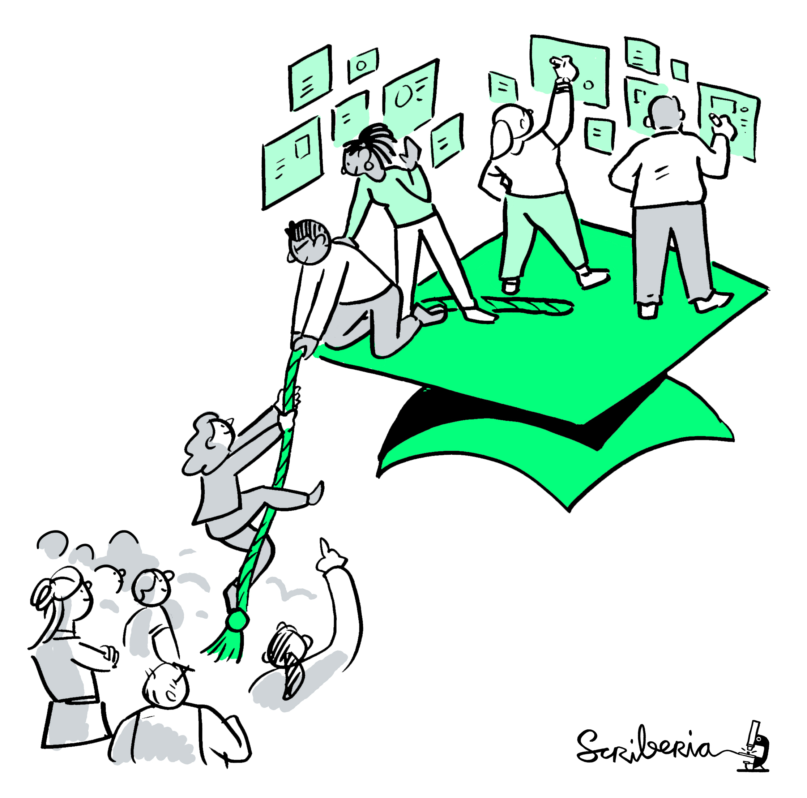

<!-- Markdown emphasis workaround (https://github.com/ramnathv/slidify/issues/224) -->

<!-- Slidify (https://github.com/ramnathv/slidify)
## Install
    library(devtools)
    install_github('ramnathv/slidify')
    install_github('ramnathv/slidifyLibraries')
## Initialize - creates a slide directory, initializes it as a git repo and opens index.Rmd for users to edit
    library(slidify)
    author('OpenScience_2_lecture')
## Author
    Write your presentation in RMarkdown editing the index.Rmd file
## Generate
    slidify('index.Rmd')
## Publish to GitHub
    publish(user = USER, repo = REPO) -->

<!-- Learning objectives (FOSTER):

    Understand the important impact of creating reproducible research.

    Understand the overall setup of reproducible research (including workflow design, data management and dynamic reporting).

    Be aware of the individual steps in the reproducibility process, as well as the corresponding resources that can be employed. -->

## Course roadmap

</img>

[Pontika et al. 2015](https://doi.org/10.1145/2809563.2809571)

--- .class #id
## 4. Reproducible research and data analysis
### Outline

* Definitions
* Rationale
* Summary
* FAQ
* Food for thought
* Practical exercises

<!-- Definitions -->

---{class: [segue, dark]}
## Definitions

--- .class #id

</img>

This image was created by Scriberia for [The Turing Way](https://the-turing-way.netlify.app/welcome.html) community and is used under a [CC-BY licence](https://creativecommons.org/licenses/by/4.0/)

--- .class #id
## Definitions

* **Reproducible research** - A result is reproducible when the _same analysis_ steps performed on the _same dataset_ consistently produces the same answer.
* **Replicable research** - A result is replicable when the _same analysis_ performed on _different datasets_ produces qualitatively similar answers.
* **Robust research** - A result is robust when the _same dataset_ is subjected to _different analysis_ workflows to answer the same research question and a qualitatively similar or identical answer is produced.
* **Generalisable research** - A result is generalisable when it is not dependent on a particular _dataset_ nor a particular version of the _analysis_ pipeline.

--- .class #id
## Definitions

* **Computational reproducibility**: When detailed information is provided about code, software, hardware and implementation details.
* **Empirical reproducibility**: When detailed information is provided about non-computational empirical scientific experiments and observations. In practice, this is enabled by making the data and details of how it was collected freely available.
* **Statistical reproducibility**: When detailed information is provided, for example, about the choice of statistical tests, model parameters, and threshold values. This mostly relates to pre-registration of study design to prevent p-value hacking and other manipulations.

> A problem with any one of these three types of reproducibility [...] can be enough to derail the process of establishing scientific facts. Each type calls for different remedies, from improving existing communication standards and reporting (empirical reproducibility) to making computational environments available for replication purposes (computational reproducibility) to the statistical assessment of repeated results for validation purposes (statistical reproducibility).

[Stodden 2014](https://www.edge.org/response-detail/25340) [Online; accessed 20 May 2021]

--- .class #id
## Reproducibility is at the core of the scientific method

</img>

[The Open Science Training Handbook](https://book.fosteropenscience.eu)

--- .class #id

<q>An article (about computational result) is advertising, not scholarship. The actual scholarship is the full software environment, code and data, that produced the result.</q> [Buckheit & Donoho 1995](https://doi.org/10.1007/978-1-4612-2544-7_5)

--- .class #id

</img>

[Marwick et al. 2017](http://faculty.washington.edu/bmarwick/PDFs/Marwick_et_al_2017_SAA_Record_Sept.pdf)

--- .class #id
## Reproducibility leads to increased rigour and quality

</img>

This image was created by Scriberia for [The Turing Way](https://the-turing-way.netlify.app/welcome.html) community and is used under a [CC-BY licence](https://creativecommons.org/licenses/by/4.0/)

--- .class #id
## Reproducibility advantages for individual researchers

</img>

[The Turing Way](https://the-turing-way.netlify.app/welcome.html)

-> [F. Markowetz - 5 selfish reasons to work reproducibly](https://www.youtube.com/watch?v=Is15CMVPHas) [Online; accessed 20 May 2021]

<!-- Rationale -->

---{class: [segue, dark]}
## Rationale

--- .class #id

</img>

[The Open Science Training Handbook](https://book.fosteropenscience.eu)

--- .class #id

</img>

[How computers broke science – and what we can do to fix it](https://theconversation.com/how-computers-broke-science-and-what-we-can-do-to-fix-it-49938) [Online; accessed 20 May 2021]

--- .class #id
## Reproducibility of scientific results in EU

"Overall the report introduces the concept of reproducibility as a continuum of practices".

</img> [Peng ]()

"It is posited that the reproducibility of results has value both as a mechanism to **ensure good science** based on truthful claims, and as a **driver of further discovery and innovation**." [Reproducibility of scientific results in the EU](https://op.europa.eu/en/publication-detail/-/publication/6bc538ad-344f-11eb-b27b-01aa75ed71a1)

--- .class #id &twocol w1:50% w2:50%
## Reasons to Share

*** =left
* Encouraging scientific advancement
* Being a good community member
* Potential to encourage others to work on the problem
* Encouraging sharing and having others share with you
* The potential to set a standard for the field
* Improvement in the caliber of research
* Increase in publicity, track metrics of impact

*** =right
* Opportunity to get feedback on your work
* Potential for finding collaborators
* Normalizing understanding in a field
* **To reproduce or to verify research**
* To make the results of publicly funded research availableto the public
* To enable others to ask new questions of extant data
* To advance the state of research and innovation

[Marwick & Birch 2018](https://doi.org/10.1017/aap.2018.3)
[Borgman 2012](https://doi.org/10.1002/asi.22634)
[Stodden 2010](https://doi.org/10.7916/D8T15BNC)

--- .class #id &twocol w1:50% w2:50%
## Reasons Not to Share

*** =left
* The _time_ it takes to clean up and document data for release
* The possibility that your data may be used without **citation**
* Legal barriers, such as **copyright**
* _Time_ to verify privacy or other administrative dataconcerns
* The potential loss of future **publications** using these data
* **Competitors** may get an advantage
* _Dealing_ with questions from users about the data

*** =right
* Technical limitations, i.e., Web platform space constraints
* Intense **competition** in the topic
* _Investment_ of large amount of work building the dataset
* Insufficient perceived reward, such as promotion or subsequent **citation**
* _Effort_ in documenting
* Concerns for **priority**, including control of results and sources
* **Intellectual property** issues

[Marwick & Birch 2018](https://doi.org/10.1017/aap.2018.3)
[Borgman 2012](https://doi.org/10.1002/asi.22634)
[Stodden 2010](https://doi.org/10.7916/D8T15BNC)

--- .class #id
## Promoting an open research culture

<q>A likely culprit for this disconnect [embracing, but not practicing open science principles] is an academic **reward system** that does not sufficiently incentivize open practices.</q> [Nosek et al. 2015](https://doi.org/10.1126/science.aab2374)

--- .class #id
### [TOP Guidelines](https://www.cos.io/initiatives/top-guidelines)

</img>

--- .class #id
### The TOP factor

"Journal policies can be evaluated based on the degree to which they comply with the TOP Guidelines. This TOP Factor is **a metric that reports the steps that a journal is taking to implement open science practices**, practices that are based on the core principles of the scientific community. It is an alternative way to assess journal qualities, and is an improvement over traditional metrics that measure mean citation rates. The TOP Factor is transparent [...] and will be responsive to community feedback." [TOP Guidelines](https://www.cos.io/initiatives/top-guidelines)

Read more about TOP Factor [here](http://cos.io/about/news/new-measure-rates-quality-research-journals-policies-promote-transparency-and-reproducibility/).

--- .class #id
### Archaeology and Anthropology journals in the TOP archive

</img> [Screenshot from 2021-05-19](https://www.topfactor.org/)

--- .class #id
## Promoting an open research culture
### Reward system

</img>

This image was created by Scriberia for [The Turing Way](https://the-turing-way.netlify.app/welcome.html) community and is used under a [CC-BY licence](https://creativecommons.org/licenses/by/4.0/)

--- .class #id
## Promoting an open research culture
### Education

</img>

This image was created by Scriberia for [The Turing Way](https://the-turing-way.netlify.app/welcome.html) community and is used under a [CC-BY licence](https://creativecommons.org/licenses/by/4.0/)

--- .class #id
## Best Practices for Scientific Computing (1 of 2)

</img>

[Wilson et al. 2014](https://doi.org/10.1371/journal.pbio.1001745)

--- .class #id
## Best Practices for Scientific Computing (2 of 2)

</img>

[Wilson et al. 2014](https://doi.org/10.1371/journal.pbio.1001745)

--- .class #id &twocol w1:50% w2:50%
## How do I make my research reproducible?

*** =left
**1. Plan for reproducibility before you start**
   - Project management (RStudio, OSF, GitHub)

**2. Keep track of things**
   - Pre-registration (OSF)
   - Version control system (Git & GitHub)
   - Documentation (README, Codebook)
   - Use software whose operation can be coded
   - Literate programming & Dynamic documents (RMarkdown)
   - Save raw data, don't save outputs
   - Save data in open formats (CSV)

*** =right
**3. Share and license your research**
   - Data repository (OSF, Zenodo, Figshare)
   - Code/software repository (GitHub)
   - Container (Rocker)
   - Publish a <u>_research compendium_</u>

**4. Report your research transparently**
   - Pre-print repository (OSF, [PCI](https://peercommunityin.org/))
   - Protocols (https://www.protocols.io/)

--- .class #id &twocol w1:50% w2:50%
## What is a research compendium?

*** =left
</img>

This image was created by Scriberia for [The Turing Way](https://the-turing-way.netlify.app/welcome.html) community and is used under a [CC-BY licence](https://creativecommons.org/licenses/by/4.0/)

*** =right
* A research compendium is a collection of all digital parts of a research project including _data_, _code_, _texts_.
* A research compendium can be constructed with minimal technical knowledge (a basic folder structure combining all components can be sufficient).
* Publishing your research paper along with a research compendium allows others to access your input, test your analysis, and, if the compendium can be executed, rerun to assess the resulting output. This does not only instill trust in your research but can give you more visibility.

<!-- Summary -->

---{class: [segue, dark]}
## Summary

--- .class #id
## Summary

* Definitions of _reproducible_, _replicable_, _robust_ and _generalisable_ studies
* Definitions of _empirical_, _computational_ and _statistical_ reproducibility
* Reproducibility at the core of the scientific method
* Issues with research reproducibility
* Ways to promoting an open research culture
* How to make reproducible research
* What is a research compendium

<!-- FAQ -->

---{class: [segue, dark]}
## FAQ*

--- .class #id

**Everything is in the paper; anyone can reproduce this from there!**

This is one of the most common misconceptions. Even having an extremely detailed description of the methods and workflows employed to reach the final result will not be sufficient in most cases to reproduce it. This can be due to several aspects, including different computational environments, differences in the software versions, implicit biases that were not clearly stated, etc.

**I don’t have the time to learn and establish a reproducible workflow.**

In addition to a significant number of freely available online services that can be combined and facilitate the setting up of an entire workflow, spending the time and effort to put this together will increase both the scientific validity of the final results as well as minimize the time of re-running or extending it in further studies.

\* [The Open Science Training Handbook](https://book.fosteropenscience.eu/)

<!-- Food for thought -->

--- .class #id
## Food for thought

> The basic building blocks of archaeological knowledge are non-replicable observations, this does not mean we are immune to the reproducibility crisis.

> But archaeological research is not just a list of sites and artefacts. In order to extract understanding from our irreproducible corpus of material, we subject it to an extraordinary range of analytical methods, most of which are replicable. This is where archaeologists have been most active in promoting reproducibility, as part of a larger trend towards open science.

> We can’t rerun the history that produced that material, or even the process through which we obtained it. So how can we obtain reproducible results from non-replicable observations?

[J. Roe. 2016. Does archaeology have a reproducibility crisis?](https://joeroe.io/2016/08/27/does-archaeology-have-a-reproducibility-crisis.html) [Online; accessed 20 May 2021]

--- .class #id
## Food for thought

-> Consider how the concepts of _empirical_ and _computational_ reproducibility apply to Archaeology.

### Further readings

* [Roebroeks et al. 2017. Uneven Data Quality and the Earliest Occupation of Europe—the Case of Untermassfeld (Germany). Journal of Paleolithic Archaeology 1, 5-31](https://doi.org/doi:10.1007/s41982-017-0003-5)

* [Merritt et al. 2019. Don't cry over spilled ink: Missing context prevents replication and creates the Rorschach effect in bone surface modification studies](https://doi.org/10.1016/j.jas.2018.07.003)
* [Domínguez-Rodrigo et al. 2017. Use and abuse of cut mark analyses: The Rorschach effect. Journal of Archaeological Science, 86, 14–23](https://doi.org/10.1016/j.jas.2017.08.001)

<!-- References & Further resources -->

--- .class #id
## References & further resources

### Reading list

* Marwick, B. Computational Reproducibility in Archaeological Research: Basic Principles and a Case Study of Their Implementation. J Archaeol Method Theory 24, 424–450 (2017). https://doi.org/10.1007/s10816-015-9272-9

### References

* [Carney & Davies 2020](http://doi.org/10.5334/jcaa.52)
* [Clarkson et al. 2017](https://doi.org/10.1038/nature22968)
  - [Addressing Reproducibility in Archaeology: Our Three-Pronged Approach](https://www.socialsciencespace.com/2017/07/addressing-reproducibility-archaeology-three-pronged-approach/)
* [Nature collection: Challenges in irreproducible research](https://www.nature.com/collections/prbfkwmwvz/)
* [Nosek et al. 2015](https://doi.org/10.1126/science.aab2374)
* [Wilson et al. 2014](https://doi.org/10.1371/journal.pbio.1001745)

--- .class #id
### Further resources

* [F. Markowetz - 5 selfish reasons to work reproducibly](https://www.youtube.com/watch?v=Is15CMVPHas)
* [K. A. Baggerly - The Importance of Reproducible Research in High-Throughput Biology](https://www.youtube.com/watch?v=7gYIs7uYbMo)

* [Peer Community In (PCI)](https://peercommunityin.org/)
  - [Peer Community In (PCI) Registered Reports](https://rr.peercommunityin.org/)
* [ReScience C](https://rescience.github.io/)

* [A Simple Explanation for the Replication Crisis in Science](https://simplystatistics.org/2016/08/24/replication-crisis/)
* [How computers broke science – and what we can do to fix it](https://theconversation.com/how-computers-broke-science-and-what-we-can-do-to-fix-it-49938)
* [Does archaeology have a reproducibility crisis?](https://joeroe.io/2016/08/27/does-archaeology-have-a-reproducibility-crisis.html)

<!-- Practical exercises -->

---{class: [segue, dark]}
## Practical exercises

--- .class #id
## Practical exercises
### Outline

* Create a research compendium
* Publish a research compendium (Zenodo / OSF)
