<!-- Markdown emphasis workaround (https://github.com/ramnathv/slidify/issues/224) -->

<!-- Slidify (https://github.com/ramnathv/slidify)
## Install
    library(devtools)
    install_github('ramnathv/slidify')
    install_github('ramnathv/slidifyLibraries')
## Initialize - creates a slide directory, initializes it as a git repo and opens index.Rmd for users to edit
    library(slidify)
    author('OpenScience_2_lecture')
## Author
    Write your presentation in RMarkdown editing the index.Rmd file
## Generate
    slidify('index.Rmd')
## Publish to GitHub
    publish(user = USER, repo = REPO) -->

<!-- Learning objectives (FOSTER):

    Learn about the different options a researcher has when deciding where to publish a paper, including funder requirements.

    Be able to decide if a paper can be published before peer review, for example in a preprint server. Trainees will learn how to determine which options they have according to their disciplines/journal policies, and if there would be consequences afterwards that might jeopardize final publication in a peer-reviewed journal.

    Trainees will learn how to discover the differences between policies of peer-reviewed journals, particularly when submitting something available as a preprint. They will learn the differences among open-access journals, such as which require a fee for submission/publication and which licenses they use.

    Trainees will learn about the implications of publishing in paywalled journals for future self-archiving in a repository, and the publisher requirements in terms of version and embargo. Trainees will also learn about hybrid open-access journals.

    (optional depending on audience) Trainees will learn about open-access opportunities when publishing in books, since this is the main avenue of dissemination for some disciplines.

    Trainees will learn about different business models used by open-access journals, and opportunities for obtaining funds to support publishing if needed. -->

## Course roadmap

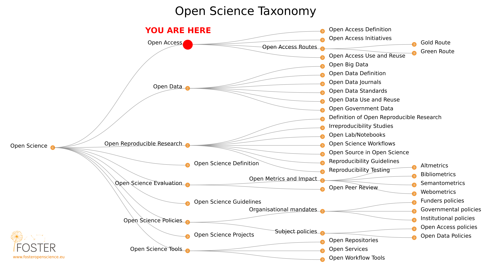</img>

[Pontika et al. 2015](https://doi.org/10.1145/2809563.2809571)

--- .class #id
## 5. Open Access to Published Research Results
### Outline

* History
* Definitions
* Rationale
* How to
* Summary
* FAQ
* Food for thought
* Practical exercises

<!-- History -->

---{class: [segue, dark]}
## History

--- .class #id
## History

* Modern science emerged in western Europe in the 17th century
* The origins of academic publishing began as well in the 17th century with the first academic journals.
  - In 1665 the 'Journal des Sçavans' and the 'Philosophical Transactions of the Royal Society of London' were first published, in France and in England respectively.
  - Increasing motivation to share resources between research disciplines, as well as increased transparency for greater efficiency, rigour, accountability, sustainability for future generations, and reproducibility.
* "Since the 17th century, the importance of journals for diffusing the results of scientific research has increased considerably. They became, at the beginning of the 19th century, the fastest and most convenient way of disseminating new research results". [Larivière et al. 2015](https://doi.org/10.1371/journal.pone.0127502)

---

* "During the 20th century they consolidated their position as the main media for diffusing research. [...] Scholarly journals also contributed to the professionalization of scientific activities by delimiting the frontier between popular science and the research front and, as a consequence, increased the level of specialization of research and the formation of disciplines". [Larivière et al. 2015](https://doi.org/10.1371/journal.pone.0127502)
* "However, prior to World War II, most scholarly journals were still published by scientific societies. Data from the mid-1990s by [Tenopir and King 1997](https://www.utpjournals.press/doi/abs/10.3138/JSP-028-03-135) suggests an increase of commercial publishers’ share of the output".[Larivière et al. 2015](https://doi.org/10.1371/journal.pone.0127502)
* [Larivière V, Haustein S, Mongeon P (2015) **The Oligopoly of Academic Publishers in the Digital Era**. PLoS ONE 10(6): e0127502.](https://doi.org/10.1371/journal.pone.0127502) analyzed the evolution over time (1973-2013) of the major publishers’ share of the scientific output in the various disciplines.
  - Drop, since the advent of the digital era in the in the mid-1990s, in the proportion of papers, journals and citations that are published/received by journals from publishers other than the five major publishers.
  - Reed-Elsevier, Wiley-Blackwell, Springer, and Taylor & Francis are amongst the top five publishers

--- .class #id

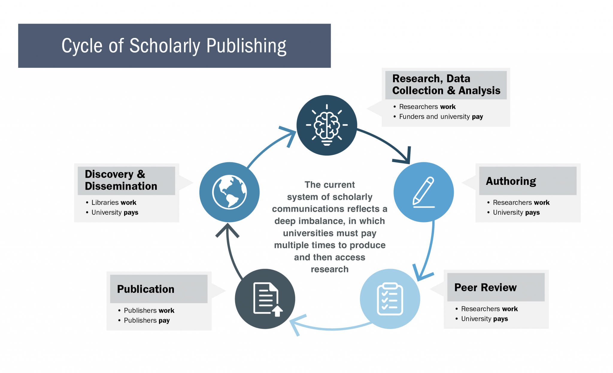</img>

[Scholarly publishing at the tipping point](https://library.unc.edu/2020/02/scholarly-publishing-at-the-tipping-point/) [Online; accessed 28 May 2021]

--- .class #id
## Cycle of Scholarly Publishing

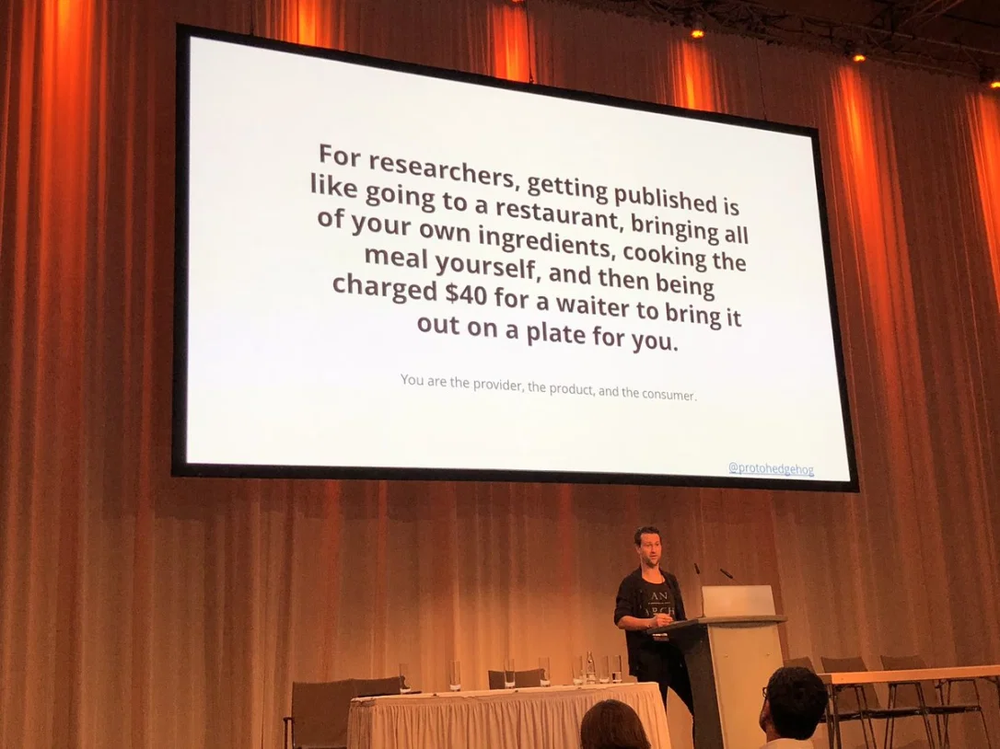</img>

[Jon Tennant](https://twitter.com/protohedgehog)

--- .class #id

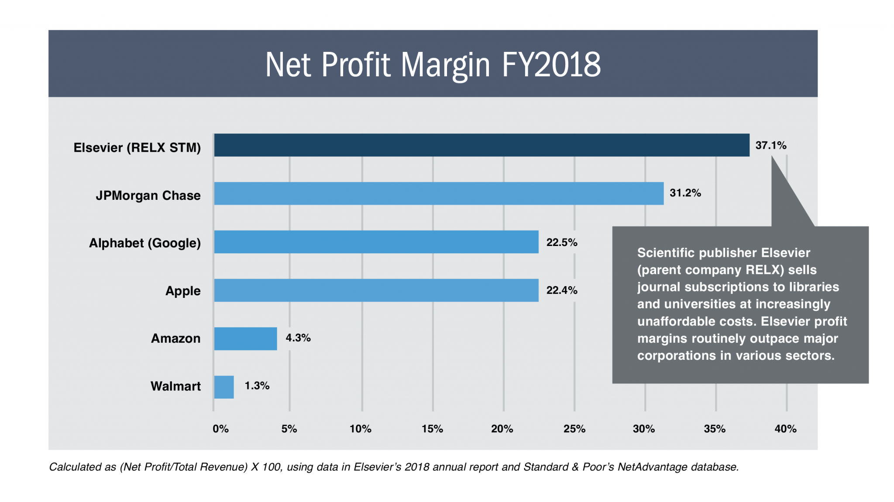</img>

[Scholarly publishing at the tipping point](https://library.unc.edu/2020/02/scholarly-publishing-at-the-tipping-point/) [Online; accessed 28 May 2021]

--- .class #id
## The serials’ crisis, Big Deal Renegotiations & Cancellation

* _Big deal_:  "A subscription to a bundle of several journals, at a discounted price. [...] It became prevalent in the 2000s as the amount of content offered by the Big Five grew beyond the perceived ability to pick specific titles to subscribe to. In a big deal, a library or consortium of libraries typically pays several million dollars per year to subscribe to hundreds or thousands of toll access journals." [From Wikipedia](https://en.wikipedia.org/wiki/Serials_crisis) [Online; accessed 28 May 2021]

* _Serials’ crisis_: Decreasing library budgets facing large and constant annual increases of journal subscription rates - [Wikipedia](https://en.wikipedia.org/wiki/Serials_crisis)

  - 2004 - Harvard University cancelled its bundled agreement and intentionally reduced its outlay for _Elsevier_ titles.

[SPARC - Big Deal Cancellation Tracking](https://sparcopen.org/our-work/big-deal-cancellation-tracking/)

--- .class #id
## [Projekt DEAL](https://www.projekt-deal.de)

The objectives of Projekt DEAL are to achieve:

- Immediate **open access** publication of all new research articles by authors from German institutions
- Permanent full-text access to the publisher’s complete journal portfolio
- Fair and reasonable pricing for such services articulated with a simple and future-oriented model based on the number of articles published

> Take the number of papers with first authors at German institutes put out by a publisher and multiply that by a reasonable fee per paper. That's what Germany should pay the publisher—and the total is likely to be much lower than current spending on subscriptions. [A bold open-access push in Germany could change the future of academic publishing](https://www.sciencemag.org/news/2017/08/bold-open-access-push-germany-could-change-future-academic-publishing)

* After several months of negotiations, SpringerNature and Wiley seem open to the model

* On 1 January 2017, when an initial deadline expired, Elsevier subscriptions lapsed at more than 60 institutions

--- .class #id

## The rise of Open Access

<!-- The accelerating pace of scientific publishing and the rise of open access, as depicted by xkcd.com cartoonist Randall Munroe. -->

</img>

[The Rise of Open Access. 2013. Science, American Association for the Advancement of Science, 342, 58-59](https://science.sciencemag.org/content/342/6154/58.full)

---
## The rise of Open Access (principles, declarations & initiative)

* [Budapest Open Access Initiative](https://www.budapestopenaccessinitiative.org/) (2002)
* [Berlin Declaration](https://openaccess.mpg.de/Berlin-Declaration) (2003)
* [The OKF Open Definition](https://opendefinition.org/) (2005)
* [Panton Principles](https://pantonprinciples.org/) (2009)
* [Denton Declaration](https://openaccess.unt.edu/denton-declaration) (2012)
* [San Francisco Declaration on Research Assessment (DORA)](https://sfdora.org/) (2012)
* [Bouchout Declaration](http://www.bouchoutdeclaration.org/declaration/) (2014)
* [Science Europe Principles on Open Access to Research Publications](https://www.scienceeurope.org/our-resources/principles-on-open-access-to-research-publications/)
* [Amsterdam Call for Action on Open Science](https://www.government.nl/documents/reports/2016/04/04/amsterdam-call-for-action-on-open-science) (2016)
* [FAIR Guiding Principles](https://doi.org/10.1038/sdata.2016.18) (2016)
* [cOAlition S](https://www.coalition-s.org/) (2018)

---
## The rise of Open Access (ERC policies)

**Open Access <u>mandatory</u> for all Horizon 2020 and Horizon Europe projects** (H. 2020 and H. Europe are the Commission's main research and innovation funding programmes)

All projects receiving H.2020 or H.Europe funding are required to make sure that any peer-reviewed journal article they publish is openly accessible, free of charge.

**Depositing publications in repositories**. "Beneficiaries must  deposit a machine-readable electronic copy of the published version or final peer-reviewed manuscript accepted for publication in a repository for scientific publications." [Guidelines](https://ec.europa.eu/research/participants/data/ref/h2020/grants_manual/hi/oa_pilot/h2020-hi-oa-pilot-guide_en.pdf) - The [Open Access Infrastructure for Research in Europe (OpenAIRE)](http://www.openaire.eu/) is the recommended entry point for researchers to determine what repository to choose.

**Providing open access to publications**. "After depositing publications beneficiaries must ensure open access to those publications via the chosen repository." [Guidelines](https://ec.europa.eu/research/participants/data/ref/h2020/grants_manual/hi/oa_pilot/h2020-hi-oa-pilot-guide_en.pdf)

--> [Open Research Europe](https://open-research-europe.ec.europa.eu/) - a scholarly publishing platform available to Horizon 2020 and Horizon Europe beneficiaries. It comes at no cost to them, has a rigorous and open peer review process, and the open access model enables everyone to access the results.

[EU's open science policy](https://ec.europa.eu/info/research-and-innovation/strategy/goals-research-and-innovation-policy/open-science_en#the-eus-open-science-policy)

---
## The rise of Open Access (DFG policies)

"The DFG supports open access. Important with respect to DFG funding is the stated benefit of this publishing method in the respective scientific context. The DFG does not see open access as an end in itself, but as a tool in its efforts to promote scholarly communication in a manner which is in line with the needs of research." [DFG - Open Access](https://www.dfg.de/en/research_funding/programmes/infrastructure/lis/open_access/index.html)

> Open access publication funding is a set allowance granted to institutions for the publication of research results via open access. It recognises that open access plays a functional role in improving scholarly communication and that its pricing should reflect this purpose. The overall objective of open access publication fundingis to facilitate structures for financing open access transformation while improving transparency with regard to the costs involved for the publication of research results in open access [Open Access Publication Funding](https://www.dfg.de/formulare/12_21/12_21_en.pdf)

--- .class #id
## "Sharing isn't immoral — it's a moral imperative" (Aaron Swartz)

Swartz committed suicide in 2013 while facing up to 35 years in prison and $1 million in fines for felony charges related to downloading a large number of research articles from the JSTOR database through MIT’s computer network. Despite the fact that Swartz had legal access to the JSTOR content through his research fellowship at Harvard and despite the fact that JSTOR chose not to pursue charges against Swartz for this alleged crime, he was nonetheless indicted by federal prosecutors in a case many considered overreaching, overzealous, and unjust.

* [Guerilla Open Access Manifesto (2008)](https://archive.org/details/GuerillaOpenAccessManifesto)
* [The Internet's Own Boy: The Story of Aaron Swartz](https://youtu.be/vXr-2hwTk58)

---
## Sci-Hub ...to remove all barriers in the way of science (Alexandra Elbakyan)

<q>The first pirate website in the world to provide mass & public access to research papers</q>

> At this time the widest possible distribution of research papers, as well as of other scientific or educational sources, is artificially restricted by copyright laws. Such laws effectively slow down the development of science in human society. The Sci-Hub project, running from 5th September 2011, is challenging the status quo. At the moment, Sci-Hub provides access to hundreds of thousands research papers every day, effectively bypassing any paywalls and restrictions.

papers in Sci-Hub library:
more than **85,483,812** [25 May 2021]

---

</img>

**Disclaimer**: Sci-hub is illegal and I am not suggesting to use it.

<!-- Definitions -->

---{class: [segue, dark]}
## Definitions

--- .class #id

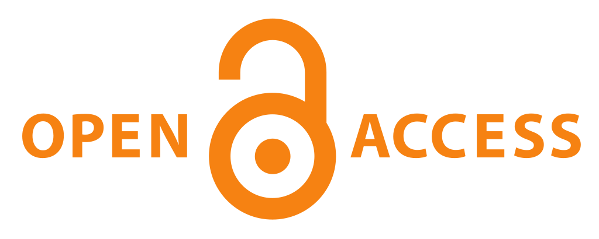</img>

[From Wikimedia Commons](https://commons.wikimedia.org/wiki/File:Open_Access_PLoS.svg)

--- .class #id
## What is Open Access?

**ACCESS**: "The work [the item or piece of knowledge being transferred] must be provided as a whole and _at no more than a reasonable one-time reproduction cost_, and should be downloadable via the Internet without charge. Any additional information necessary for license compliance (such as names of contributors required for compliance with attribution requirements) must also accompany the work." [Open Definition 2.1](https://opendefinition.org/od/2.1/en/)

"Open Access to publications means that research publications like articles and books can be accessed online, _free of charge by any user_, with no technical obstacles (such as mandatory registration or login to specific platforms). At the very least, such publications can be read online, downloaded and printed. Ideally, additional rights such as the right to copy, distribute, search, link, crawl and mine should also be provided." [The Open Science Training Handbook](https://book.fosteropenscience.eu/en/)

--- .class #id
## What is Open Access?

<q>The world-wide electronic distribution of the peer-reviewed journal literature and completely **free** and **unrestricted access** to it by all scientists, scholars, teachers, students, and other curious minds.</q>

[Budapest Open Access Initiative](https://www.budapestopenaccessinitiative.org)

--- .class #id
## What is Open Access?

> By "open access" to this literature, we mean its free availability on the public internet, permitting any users to _read_, _download_, _copy_, _distribute_, _print_, _search_, or _link_ to the full texts of these articles, _crawl_ them for indexing, _pass_ them as data to software, or _use_ them for any other lawful purpose, **without financial, legal, or technical barriers** other than those inseparable from gaining access to the internet itself. The only constraint on reproduction and distribution, and the only role for copyright in this domain, should be to _give authors control over the integrity of their work and the right to be properly acknowledged and cited_.

> The literature that should be freely accessible online is that which scholars give to the world without expectation of payment. Primarily, this category encompasses their peer-reviewed journal articles, but it also includes any unreviewed preprints that they might wish to put online for comment or to alert colleagues to important research findings. [Budapest Open Access Initiative](https://www.budapestopenaccessinitiative.org)

To achieve open access to scholarly journal literature, The BOAI recommend two complementary strategies:

* **Self-Archiving**
* **Open Access Journals**

--- .class #id
## The Green Open Access (self-archiving) route

> <u>Self-Archiving</u>: First, scholars need the tools and assistance to **deposit their refereed journal articles in open electronic archives**, a practice commonly called, self-archiving. When these archives conform to standards created by the Open Archives Initiative, then search engines and other tools can treat the separate archives as one. Users then need not know which archives exist or where they are located in order to find and make use of their contents. [Budapest Open Access Initiative](https://www.budapestopenaccessinitiative.org)

"**The published work [version of record] or the final peer-reviewed manuscript that has been accepted for publication [postprint] is made freely and openly accessible by the author, or a representative, in an online repository**. Some publishers request that Open Access be granted only after an _embargo_ period has elapsed. This _embargo_ period can last anywhere between several months and several years. For publications that have been deposited in a repository but are under _embargo_, usually at least the metadata are openly accessible." [The Open Science Training Handbook](https://book.fosteropenscience.eu/en/)

--- .class #id

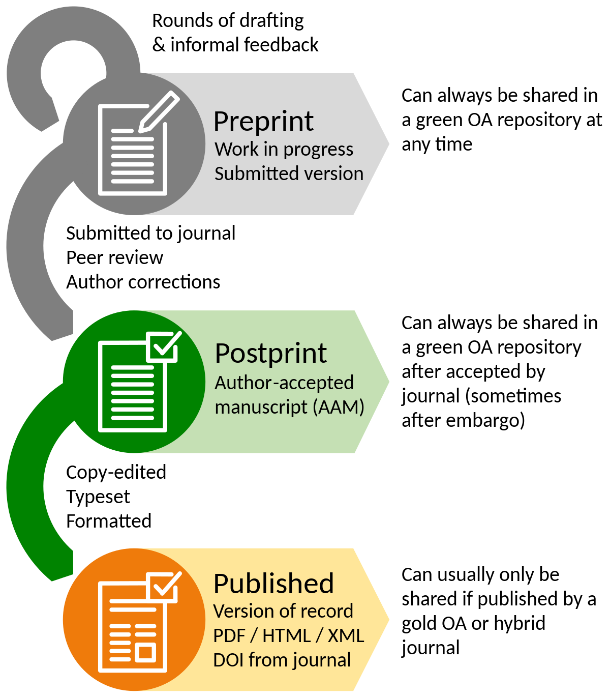</img>

--- .class #id
## The Gold Open Access route

The published work is made available in Open Access mode by the publisher immediately upon publication. The most common business model is based on one-off payments by the author’s institutions or research funder (commonly called **APCs – article processing charges**).

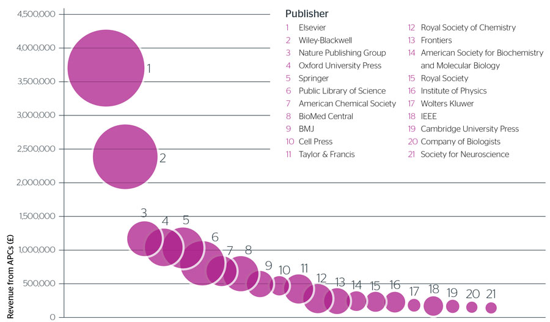</img>

[Article processing charges (APCs) and subscriptions. Monitoring open access costs (2016)](https://www.jisc.ac.uk/reports/apcs-and-subscriptions) [Online accessed 28 May 2021]

--- .class #id &twocol w1:50% w2:50%

## Hybrid Open Access journals

Where Open Access content is combined with content that requires a subscription or purchase, in particular in the context of journals, conference proceedings and edited volumes, this is called hybrid Open Access.

*** =left

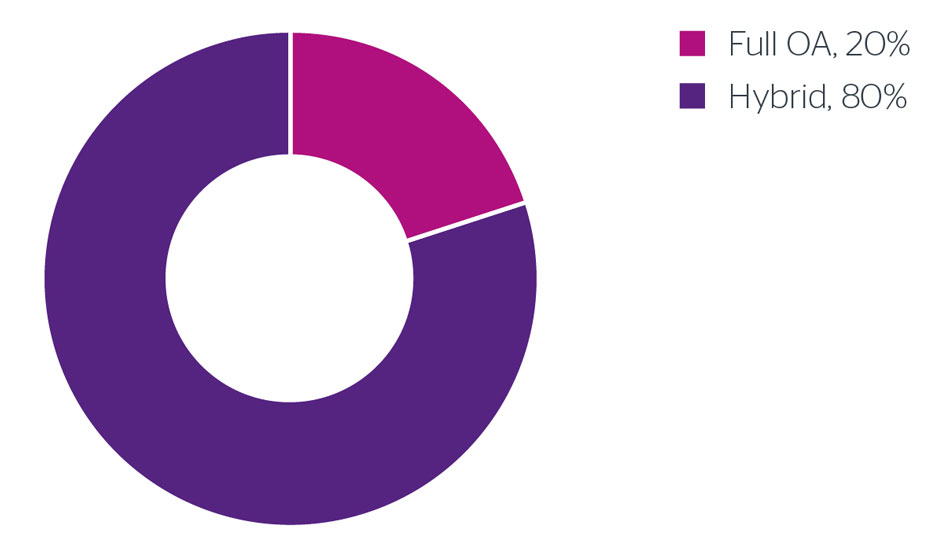</img>

[Article processing charges (APCs) and subscriptions. Monitoring open access costs (2016)](https://www.jisc.ac.uk/reports/apcs-and-subscriptions) [Online accessed 28 May 2021]

*** =right

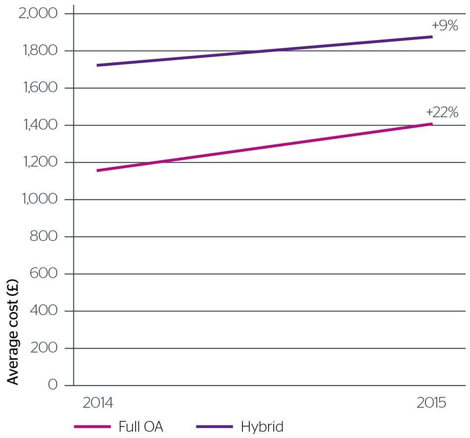</img>

---
## Full Open Access journals

> <u>Open-access Journals</u>: Second, scholars need the means to launch a new generation of journals committed to open access, and to help existing journals that elect to make the transition to open access. Because journal articles should be disseminated as widely as possible, these new journals **will no longer invoke copyright to restrict access to and use of the material they publish**. Instead they will use copyright and other tools to ensure permanent open access to all the articles they publish. Because price is a barrier to access, these new journals **will not charge subscription or access fees**, and will turn to other methods for covering their expenses. There are many alternative sources of funds for this purpose, including the foundations and governments that fund research, the universities and laboratories that employ researchers, endowments set up by discipline or institution, friends of the cause of open access, profits from the sale of add-ons to the basic texts, funds freed up by the demise or cancellation of journals charging traditional subscription or access fees, or even contributions from the researchers themselves. There is no need to favor one of these solutions over the others for all disciplines or nations, and no need to stop looking for other, creative alternatives. [Budapest Open Access Initiative](https://www.budapestopenaccessinitiative.org)

* [Directory of Open Access Repository (DOAR)]()
* [Directory of Open Access Journals (DOAJ)](https://doaj.org/)
* [Directory of Open Access Books (DOAB)](https://www.doabooks.org/)

--- .class #id

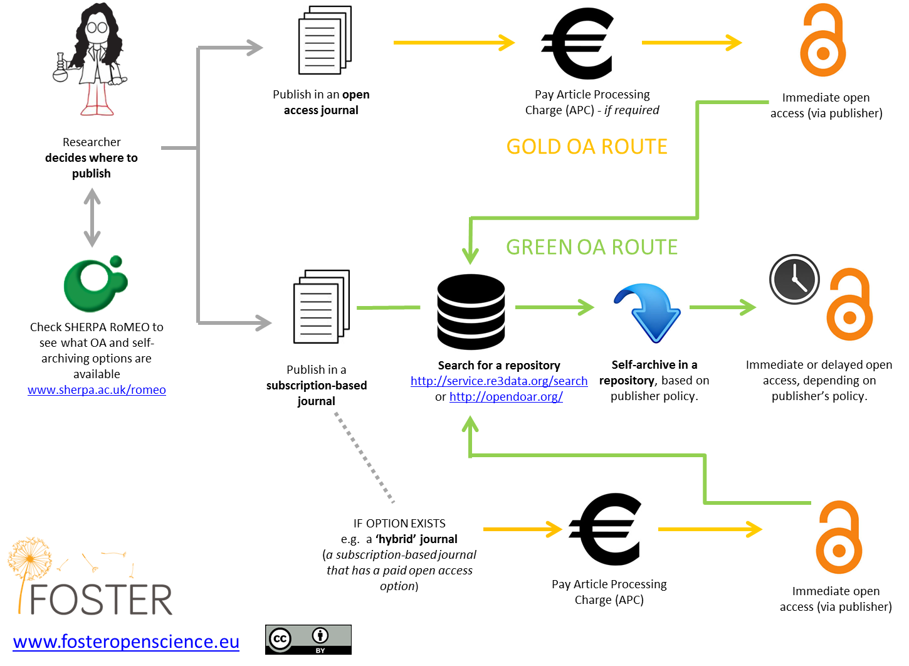</img>

--- .class #id

</img>

[Sherpa Romeo: Journal of Archaeological Science (Elsevier)](https://v2.sherpa.ac.uk/id/publication/13775) [Online; accessed 7 June 2021]

---

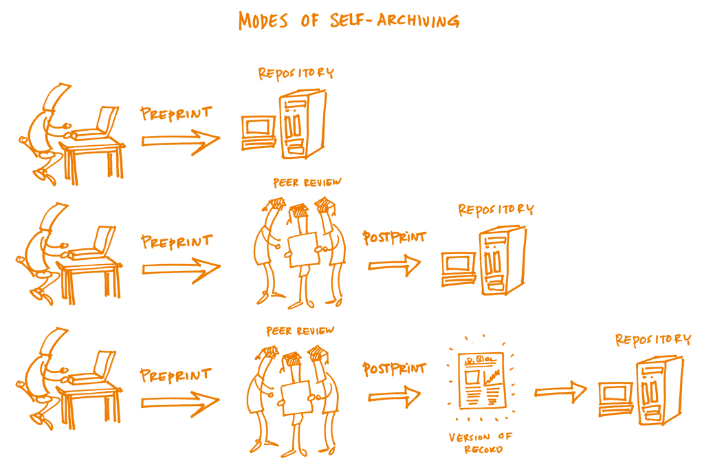</img>

[The Open Science Training Handbook](https://book.fosteropenscience.eu/en/)

--- .class #id
## Pre-print repositories

* [OSF Preprints](https://osf.io/preprints/)
* [Zenodo](https://zenodo.org/)
* [Peer Community In (PCI)](https://peercommunityin.org/) - "Stimulating, open, free, independent, not exclusive and reliable"
  - [PCI Archaeology](https://archaeo.peercommunityin.org/)
  - [PCI Evolutionary Biology](https://evolbiol.peercommunityin.org/)
  - [PCI Genomics](https://genomics.peercommunityin.org/)
* [PCI Registered Reports](https://rr.peercommunityin.org/)

<!-- Rationale -->

---{class: [segue, dark]}
## Rationale

---

<q>Accelerate research, enrich education, share the learning of the rich with the poor and the poor with the rich, make this literature as useful as it can be, and lay the foundation for _uniting humanity in a common intellectual conversation and quest for knowledge_.</q>

[Budapest Open Access Initiative](https://www.budapestopenaccessinitiative.org)

---

<q>Open access is _economically feasible_, that it gives readers extraordinary power to find and make use of relevant literature, and that it gives authors and their works vast and measurable new visibility, readership, and impact.</q>

[Budapest Open Access Initiative](https://www.budapestopenaccessinitiative.org)

---
## Benefits

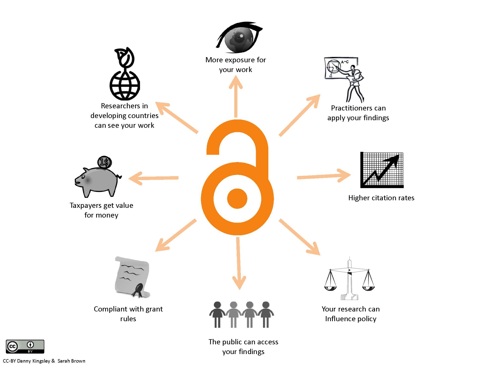</img>

[From Wikimedia Commons](https://commons.wikimedia.org/wiki/File:Benefitsofopenaccess_cc-by_logo.pd_eng.jpg)

---
## Challenges

> The use of publishing platforms has implications for research evaluation, the peer-review process, and the role of publishers. There are still many research assessments based on journal metrics and therefore this new way of publishing challenges those evaluations. Moreover the fact that peer review is completely transparent allows readers to identify reviewers and track the versioning of the paper. Finally, if those platforms become the common tool to publish results, publishers would need to redefine their role in the scholarly communication process. [The Open Science Training Handbook](https://book.fosteropenscience.eu/en/)

<!-- How to -->

---{class: [segue, dark]}
## How to

---

</img>

[How to make your work 100% Open Access for free and legally](https://figshare.com/collections/How_to_make_your_work_100_Open_Access_for_free_and_legally_multi-lingual_/3943972) [Online; accessed 28 May 2021]

--- .class #id &twocol w1:50% w2:50%

*** =left

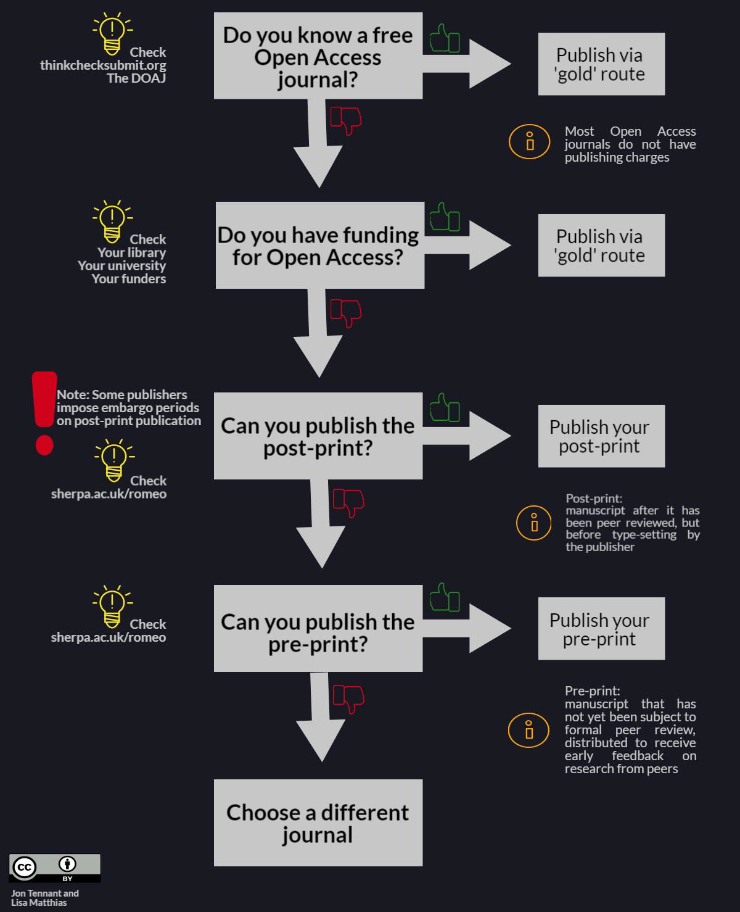</img>

*** =right

--> Search the [Directory of Open Access Journals (DOAJ)](https://doaj.org/) for OA journals without article processing charges (APCs)

--> If you have funding, go for hybrid OA journals (Gold route)

--> If you don't have funding, go for the green route. Publish your _post-print_ after the embargo period.

--> You can always publish your pre-print anywhere (better in pre-print repositories)

<!-- Summary -->

---{class: [segue, dark]}
## Summary

--- .class #id
## Summary

* History of scholarly publishing and Open Access movement
* EU & DFG Open Access policies
* Definition of Open Access (Budapest Open Access Initiative)
* Green Open Access (Self-archiving) / Gold Open Access route (APC) routes
* Full / Hybrid Open Access journals
* Preprint / Postprint / Version of record (Elsevier policy)
* Preprint repositories
* Benefits & Challenges
* How to publish OA

<!-- FAQ -->

---{class: [segue, dark]}
## FAQ*

--- .class #id
**If I publish my work as a preprint, it won’t be acknowledged - I will only receive credit for a peer-reviewed journal article.**

Many funders are acknowledging the growing presence of preprint publishing in their policies: Howard Hughes Medical Institute (HHMI), Wellcome Trust, the Medical Research Council (UK) and the National Institutes of Health (NIH) announced policies allowing researchers to cite their own preprints in grant applications and reports ([Luther 2017](https://scholarlykitchen.sspnet.org/2017/04/18/stars-aligning-preprints/)). In addition, preprints help establish priority of results and may increase the impact - and citation count - of a later peer-reviewed article ([McKiernan 2016](https://doi.org/10/gbqsng)).

\* [The Open Science Training Handbook](https://book.fosteropenscience.eu/)

<!-- Food for thought -->

--- .class #id
## Food for thought

>The number of Open Access Journals has increased during the last years becoming a real option for researchers when deciding where to publish their findings. According to the Directory of Open Access Journals (DOAJ), currently there are more than 11,000 journals. [The Open Science Training Handbook](https://book.fosteropenscience.eu/)

> as of 31 January 2018, DOAJ reports that 71% of the 11,001 open-access journals listed require no publishing charge). https://sustainingknowledgecommons.org/2018/02/06/doaj-apc-information-as-of-jan-31-2018/

> One of the reasons researchers choose the hybrid model [w/ APC] is to fulfil some of the requirements of funders policy, especially the ones requiring immediate public access to research results or short embargo periods. [The Open Science Training Handbook](https://book.fosteropenscience.eu/)

OR... One of the reasons researchers choose the hybrid model [w/ APC] is due to the fact that the most successful journals and the ones that got the highest impact follow this model AND there are still many research assessments based on journal metrics.

Despite major funding agencies (e.g., ERC and DFG) are promoting Open Science, publishing in impact factor journals is still a driving criterium for the assignment of research funds. The current scholarly cycle won't break, until different criteria won't take ground upstream.

<!-- References & Further resources -->

--- .class #id
## References & further resources

### Reading list

* Marwick, B. 2020. Open access to publications to expand participation in archaeology. Norwegian Archaeological Review. https://doi.org/10.1080/00293652.2020.1837233

### References

* [Larivière V, Haustein S, Mongeon P (2015) **The Oligopoly of Academic Publishers in the Digital Era**. PLoS ONE 10(6): e0127502.](https://doi.org/10.1371/journal.pone.0127502)

### Further resources

* [Paywall](https://vimeo.com/paywallthemovie)

<!-- Practical exercises -->

---{class: [segue, dark]}
## Practical exercises

--- .class #id
## Practical exercises
### Outline

* Git & GitHub workflow
  - Creating and merging pull request
