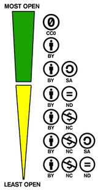
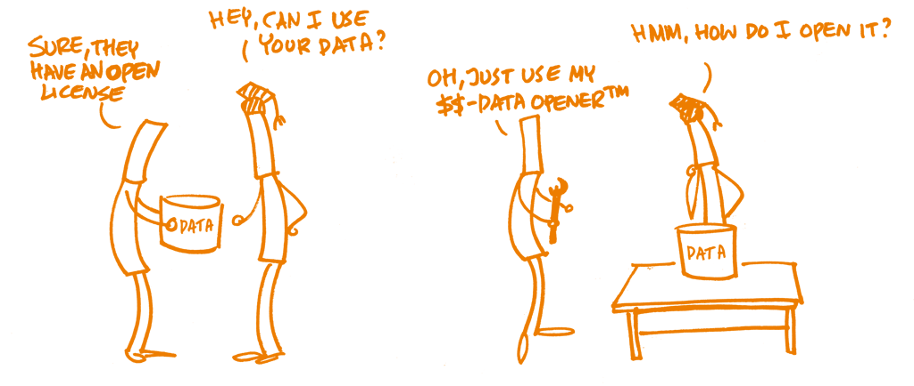
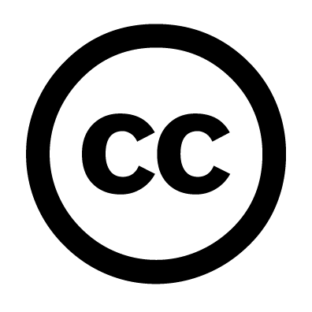

<!-- Markdown emphasis workaround (https://github.com/ramnathv/slidify/issues/224) -->

<!-- Slidify (https://github.com/ramnathv/slidify)
## Install
    library(devtools)
    install_github('ramnathv/slidify')
    install_github('ramnathv/slidifyLibraries')
## Initialize - creates a slide directory, initializes it as a git repo and opens index.Rmd for users to edit
    library(slidify)
    author('OpenScience_2_lecture')
## Author
    Write your presentation in RMarkdown editing the index.Rmd file
## Generate
    slidify('index.Rmd')
## Publish to GitHub
    publish(user = USER, repo = REPO) -->

<!-- Learning objectives (FOSTER):

    Participants should learn about differences among licenses and how they can suit some open-science definitions, open-science requirements, or how they fit into different research outcomes.

    Learn about the different building blocks of licenses, such as attribution, (non-)commercial, derivatives, etc.

    Learn the importance of defining who holds the copyright or related rights of research output.

    Learn about the differences between proprietary and open file formats, and how these can prevent or facilitate reusability and interoperability. -->

## 6. Open Licensing and File Formats
### Outline

* Definitions
* Rationale
* How to
* Summary
* FAQ
* Food for thought

<!-- Definitions -->

---{class: [segue, dark]}
## Definitions

--- .class #id
## Copyright

A bundle of **rights protecting the rights of authors**, composers, artists, film makers and other creators by ensuring that they receive recognition, payment and protection for their works. It includes moral and economic rights. [EU copyright policies](https://digital-strategy.ec.europa.eu/en/policies/copyright)

The EU copyright legislation consists of 11 directives and 2 regulations, harmonising the essential rights of authors, performers, producers and broadcasters. [The EU copyright legislation](https://digital-strategy.ec.europa.eu/en/policies/copyright-legislation)
  - Directive on the legal protection of computer programs (“[Software Directive](https://eur-lex.europa.eu/legal-content/en/TXT/?uri=CELEX:32009L0024)”), 23 April 2009
  - Directive on the enforcement of intellectual property right (“[IPRED](https://eur-lex.europa.eu/legal-content/EN/TXT/?uri=CELEX:32004L0048)”), 29 April 2004
  - Directive on the legal protection of databases (“[Database Directive](https://eur-lex.europa.eu/legal-content/EN/ALL/?uri=CELEX:31996L0009)”), 11 March 1996

**Licensing is the main mechanism for the exercise of copyright and related rights.**

Licences are most often granted directly by the rightholder.

--- .class #id
## Copyleft

The term 'copyleft' originated in the free software community and refers to licenses that allow derivative works but require them to use the same license as the original work.

</img>

[The Turing Way](https://the-turing-way.netlify.app/reproducible-research/licensing/licensing-software.html)

--- .class #id
## The 4 Essential Freedoms

A program is free software if the program's users have the four essential freedoms:

* The freedom (0) to **run** the program as you wish, for any purpose
* The freedom (1) to **study** how the program works, and **change** it so it does your computing as you wish. *Access* to the source code is a precondition for this.
* The freedom (2) to **redistribute** copies so you can help others.
* The freedom (3) to **distribute** copies of your modified versions to others. By doing this you can give the whole community a chance to benefit from your changes. *Access* to the source code is a precondition for this.

[Free Software Foundation](https://www.gnu.org/philosophy/free-sw.html)

--- .class #id
## What is an Open License?

**Licensing is the main mechanism for the exercise of copyright and related rights.**

"A license is a legal document that grants specific rights to user to reuse and redistribute a material under some _conditions_. Any right that is not granted by default by the licensor through the license can be asked. Licenses can be applied to any material (e.g., sound, text, image, multimedia, software) where some exploitation or usage rights exist." [The Open Science Training Handbook](https://book.fosteropenscience.eu/)

An _OPEN LICENSE_ is a license that grant permission to **access**, **re-use**, and **redistribute** material with few or no restrictions (it ranges from very open to very restrictive).

--- .class #id
## Defining Open Licenses ([Open Definition](https://opendefinition.org/od/2.1/en/))

A license is open if its terms satisfy the following conditions:

1. The license must irrevocably **permit** (or allow) the following:

   _Use, Redistribution, Modification, Separation, Compilation, Non-discrimination, Propagation, Application to Any Purpose, No Charge_

2. The license must not limit, make uncertain, or otherwise diminish the permissions required in Section 1 except by the following allowable **conditions**:

  _Attribution, Integrity, Share-alike, Notice, Source, Technical restriction prohibition, Non-aggression_

--- .class #id
## Types of Open Licenses

### Software licenses (Copyleft & Non-Copyleft/Permessive)

A software license governs the extent of use or redistribution of software

  - Code: **MIT**

### Non-software licenses

  - Data: **CC0**, [Open Data Commons](https://opendatacommons.org/)
  - Doc (Text/Figures): **CC-BY**

--> V. Stodden, "The Legal Framework for Reproducible Scientific Research: Licensing and Copyright," in Computing in Science & Engineering, vol. 11, no. 1, pp. 35-40, Jan.-Feb. 2009, doi: [10.1109/MCSE.2009.19](https://doi.org/10.1109/MCSE.2009.19).

--- .class #id
## MIT

Copyright \<YEAR\> \<COPYRIGHT HOLDER\>

Permission is hereby granted, free of charge, to any person obtaining a copy of this software and associated documentation files (the "Software"), to deal in the Software without restriction, including without limitation the rights to use, copy, modify, merge, publish, distribute, sublicense, and/or sell copies of the Software, and to permit persons to whom the Software is furnished to do so, subject to the following conditions:

The above copyright notice and this permission notice shall be included in all copies or substantial portions of the Software.

THE SOFTWARE IS PROVIDED "AS IS", **WITHOUT WARRANTY OF ANY KIND**, EXPRESS OR IMPLIED, INCLUDING BUT NOT LIMITED TO THE WARRANTIES OF MERCHANTABILITY, FITNESS FOR A PARTICULAR PURPOSE AND NONINFRINGEMENT. IN NO EVENT SHALL THE AUTHORS OR COPYRIGHT HOLDERS BE LIABLE FOR ANY CLAIM, DAMAGES OR OTHER LIABILITY, WHETHER IN AN ACTION OF CONTRACT, TORT OR OTHERWISE, ARISING FROM, OUT OF OR IN CONNECTION WITH THE SOFTWARE OR THE USE OR OTHER DEALINGS IN THE SOFTWARE.

--- .class #id &twocol w1:50% w2:50%
##  Creative Commons Licenses

"The Creative Commons copyright licenses and tools forge a balance inside the traditional “all rights reserved” setting that copyright law creates. Our tools give everyone from individual creators to large companies and institutions a simple, standardized way to grant copyright permissions to their creative work." [CC Licenses](https://creativecommons.org/licenses/)

*** =left

**CC0**

**BY** (Attribution Required)

**SA** (ShareAlike - Distributed on Same Terms)

**ND** (NoDerivatives - Modifying Not Allowed)

**NC** (NonCommercial - Commercial Use Not Allowed)

*** =right

</img>

--- .class #id
## The Creative Commons Public Domain Dedication (CC0)

> "**Public domain**" is a technical term in copyright law that refers to works not under copyright — either because they were never in copyright to begin with [...], or because their copyright term has finally lapsed and they have "fallen into" the public domain. [...] Not all jurisdictions have a public domain, and it doesn't always mean exactly the same thing in the jurisdictions that do have it. Furthermore, even where it is clear what it means, it's still _not a license_. To be subject to a license, a work must still be in copyright. [Open Source Initiative](https://opensource.org/faq#osd)

> For example, in Germany and other European countries it is not possible to fully waive copyright, and thus fully dedicating work to the public domain is not legally possible. Instead, the CC0 license can be used as an "effective" public domain license that allows unrestricted use. [The Open Science Training Handbook](https://book.fosteropenscience.eu/)

### CC0 “No Rights Reserved”

> CC0 enables scientists, educators, artists and other creators and owners of copyright- or database-protected content to waive those interests in their works and thereby place them as completely as possible in the public domain, so that others may freely build upon, enhance and reuse the works for any purposes without restriction under copyright or database law. [CC0](https://creativecommons.org/share-your-work/public-domain/cc0/)

* Originally created as a legal tool to release scientific databases without any restriction.

--- .class #id
## The Creative Commons Attribution Required (CC BY)

</img>

* [CC BY](https://creativecommons.org/licenses/by/4.0/)

--- .class #id
## What is an Open Format

<q>An open format is one which places no restrictions, monetary or otherwise, upon its use and can be fully processed with at least one free/libre/open-source software tool.</q> [Open Definition](https://opendefinition.org/od/2.1/en/)

--- .class #id
## Open formats

* Text: TXT, RTF, ODT, PDF/A (~~.doc, .docx~~)
* Tabular data: CSV, TSV (~~.xls, .xlsx~~)
* Image: TIFF, PNG, JPG 2000, SVG (~~.psd, .ai~~)
* 3D: PLY, OBJ
* Spatial data: CSV, GeoTIFF, Simple Features (~~.shp - Shape files~~)
  - [Open Source Geospatial Consortium (OSGeo)](https://www.osgeo.org/)
* Audio: WAV, FLAC, OPUS
* Video: MPEG2, Theora, VP8, VP9, AV1, Motion JPG 2000 (MJ2)

> Some file formats cannot be converted to open formats, but are nonetheless archived. They are often device-specific, but have a broad user community.

> Within the context of Open Science, and for optimal long-term archiving, files should not be compressed and should avoid proprietary or patent-encumbered formats and in favor of open formats based on documented standards. This ensures the access and re-usability of the content. Only unencrypted files should be published and archived. [The Open Science Training Handbook](https://book.fosteropenscience.eu/)

<!-- Rationale -->

---{class: [segue, dark]}
## Rationale

--- .class #id
## Open Access & Open Licences & Open Formats

> By "open access" to this literature, we mean its free availability on the public internet, **permitting any users to** _read_, _download_, _copy_, _distribute_, _print_, _search_, or _link_ to the full texts of these articles, _crawl_ them for indexing, _pass_ them as data to software, or _use_ them for any other lawful purpose, without financial, legal, or technical barriers other than those inseparable from gaining access to the internet itself. The only constraint on reproduction and distribution, and the only role for **copyright** in this domain, should be to _give authors control over the integrity of their work and the right to be properly acknowledged and cited_. [Budapest Open Access Initiative](https://www.budapestopenaccessinitiative.org)

</img>

[The Open Science Training Handbook](https://book.fosteropenscience.eu/)

--- .class #id
## Your Work. Your Rights.

Copyright arises automatically as soon as a work is created. For academic work (academic output), this usually means as soon as it is written. No application or registration is necessary.

https://sparcopen.org/our-work/author-rights/

> Without a license, all rights are with the author [...], and that means nobody else can use, copy, distribute, or modify the work without consent. A license gives this consent. If you do not have a license for your [work], it is effectively unusable by the whole research community. https://the-turing-way.netlify.app/reproducible-research/licensing.html

> A common misconception is that simply putting data/code online makes them Open data/code, free to be used, modified, and shared for any purpose. In fact, unless the data/code are accompanied by a license that grants permission for others to use, modify, and/or distribute, then the author(s) retain exclusive copyright. **A license needs always to accompany the data/code to make them Open** (and prevent research misconduct, such as _plagiarism_ - the appropriation of another person's ideas, data, code, results, or words without giving appropriate credit). [The Open Science Training Handbook](https://book.fosteropenscience.eu/)

--- .class #id
## Transfer of Copyright Agreement

### Copyright implications when signing a transfer document

Copyright can be transferred to a third party (a private individual or a legal person like a publishing company) by the creator in a written contract or an assignment

In traditional academic journals, with a 'Transfer of Copyright Agreement' the copyright is transferred from the author to the journal publishers, with minor variations -> the author transfers (all) their rights of the work to the publisher, including those pertaining to electronic forms and transmissions, and can no longer exercise control over how the publisher uses those rights.

[Elsevier copyright policy](https://www.elsevier.com/about/policies/copyright)

--- .class #id
## Transfer of Copyright Agreement

### Rights usually retained by author(s) after signing a publishing agreement

* to use their research data freely without any restriction
* to make further copies of all or part of the work _for private use and classroom teaching_.
* to reuse all or part of the work _in a compilation_ of a work or _text book_ of which you are the author.
* to make copies of the published work _for internal distribution within the institution_ that employs you.
* to publicly share the _preprint_ on any website or repository at any time.
* to publicly share the _accepted manuscript_ on non-commercial sites (for articles published open access) / using a CC BY-NC-ND license and usually only after an embargo period (for articles published under the subscription model)

[Elsevier copyright policy](https://www.elsevier.com/about/policies/copyright)

--- .class #id
## Elsevier Policy (Journal of Archaeological Science)

</img>

[Sherpa Romeo](https://v2.sherpa.ac.uk/id/publication/13775)

--- .class #id
## Author Addenda

An [author addendum](http://oad.simmons.edu/oadwiki/Author_addenda) is a proposed modification to a publisher's standard copyright transfer agreement. If accepted, it would allow the author to retain key rights, especially the right to authorize OA.

* [The SPARC Author Addendum](https://sparcopen.org/our-work/author-rights/brochure-html/)
* [EC cover letter for amendment to publishing agreement](http://ec.europa.eu/research/science-society/document_library/pdf_06/model-cover-letter-for-amendment_en.zip)
* [EC amendment to publishing agreement](http://ec.europa.eu/research/science-society/document_library/pdf_06/model-amendment-publishing-agreement_en.zip)
* [Science Commons. Scholar’s Copyright Addendum Engine](https://perma.cc/P63K-BTRL)
* [cOAlition S Rights Retention Strategy](https://www.coalition-s.org/rights-retention-strategy/)

--- .class #id
## EC Policy

> The Commission encourages authors to retain their copyright and grant _adequate licences_ to publishers. **Creative Commons** offers useful licensing solutions. This type of licence is a good legal tool for providing open access  in its broadest sense. [Guidelines to the Rules on Open Accessto Scientific Publications and Open Access to Research Data in Horizon 2020](https://ec.europa.eu/research/participants/data/ref/h2020/grants_manual/hi/oa_pilot/h2020-hi-oa-pilot-guide_en.pdf) [Version 3.2]

</img>

[Sherpa Juliet - ERC policy](https://v2.sherpa.ac.uk/id/funder/31)

<!-- How to -->

---{class: [segue, dark]}
## How to

--- .class #id
## Considerations Before Licensing

There are a number of things you should consider before you apply a Creative Commons license to your work:

• **Remember the license may not be revoked** • Make sure the material is appropriate for CC licensing • Specify precisely what it is you are licensing • **Make sure the material is subject to copyright or similar rights** • Clear rights needed to use the material • Indicate rights not covered by the license • Think about how you want the material to be used • Consider any obligations that may affect what type of license you apply • Consider offering a warranty • Specify additional permissions, if desired • Specify attribution information if desired • Indicate any non binding requests

[Considerations for licensors](https://wiki.creativecommons.org/wiki/Considerations_for_licensors_and_licensees#Considerations_for_licensors)

--- .class #id
## Considerations Before Licensing

* **The licenses and CC0 cannot be revoked**. This means once you apply a CC license to your material, anyone who receives it may rely on that license for as long as the material is protected by copyright, even if you later stop distributing it.

* **You must own or control copyright in the work**. Only the copyright holder or someone with express permission from the copyright holder can apply a CC license or CC0 to a copyrighted work. If you created a work in the scope of your job, you may not be the holder of the copyright.

--> Understanding your rights!

[SPARC - Copyright Resources for Authors](https://sparcopen.org/our-work/author-rights/introduction-to-copyright-resources/)

---
## Choose a license

</img>

[Choosealicense.com](https://choosealicense.com/)

[Creative Commons LICENSE CHOOSER](https://chooser-beta.creativecommons.org/)

---
## License your  Work

* Stating the chosen license clearly and prominently, preferably in a machine readable format.
  - Licensing your work is as simple as marking it under the specific license you choose. This marking can be as simple as a bit of text stating the license in a copyright notice, or as complex as embedding the license information on your website using the HTML code associated with the particular license. We strongly recommend at least including a link to the applicable license.
* Explain the liberations/limitations of the chosen license, and what barriers or restrictions may apply.
* Let users know where they can find more information about this license.
* Explain that the license applies to the data, and not the content that the data represents (an open license on the metadata is not the same as the content itself being open, out of copyright, or able to be used freely).
* Explain why this license was chosen.

[Data Packaging Guide](https://github.com/saverkamp/beyond-open-data/blob/master/DataGuide.md)

---
## Checklist (GitHub repo)

✔️ Go to your repository folder (local computer or online repository on GitHub/GitLab/BitBucket)

✔️ Create a new file and name is License.txt or License.md based on your preference of the file format

✔️ Choose a type of license (or multiple license for mixed content) that is suitable for your project (visit [choosealicense.com](choosealicense.com))

✔️ Copy the license content to the newly created file, for example, you can use an Open Source license CC-BY 4.0 for text content and MIT License for software

✔️ Save your file and add details in your README.md file

--> https://github.com/dncgst/openscience_course

[The Turing Way](https://the-turing-way.netlify.app/reproducible-research/licensing/licensing-checklist.html)

<!-- Summary -->

---{class: [segue, dark]}
## Summary

--- .class #id
## Summary

* Definitions of Copyright & Open Licenses
  - MIT (software/code); CC0 (data); CC-BY (text/figures)
* Open formats to ensure access and re-usability
* Reasons to licence your work
  - Without a license, all rights are with the author
  - A license needs always to accompany the work to make it Open
* How to licence your work
  - Understand yoour rights, before applying a license
  - Remember the license may not be revoked
  - Choose an open license
  - Licence your work, as simple as pasting a text (e.g., "This work is licensed under CC BY 4.0")

<!-- FAQ -->

---{class: [segue, dark]}
## FAQ*

--- .class #id
**Why should I use the CC-BY license for my written/creative content?**

The CC-BY license is the most permissive license that also retains some rights for the creators — the only requirement is that someone who uses, modifies, or distributes the content attributes the original creator. Other attributes of Creative Commons licenses include No Derivatives (ND), Non Commercial (NC), and Share Alike (SA), which add additional restrictions that may limit the potential use and impact of your work. Preventing derivatives with ND strongly limits the impact and use of your work, since no one else will be able to build on what you have done. Similarly, while many researchers may prefer the NC limitation to prevent companies from commercializing or making money on their work, strictly defining commercial use is challenging. Furthermore, the intent of much publicly funded research is to lead to economic development through (ventual) commercial use, which would be prevented by this license. Using an SA license allows reuse and distribution, but requires downstream works to apply the same license, limiting use and combination with other works.

> The  Share  Alike  concept  is  inappropriate  in  the scientific context because it can impose limits on the  use  and  reuse  of  others’  work,  which  in  the scientific  context,  should  be  avoided  whenever possible. [Stodden 2009](https://dl.acm.org/doi/10.1109/MCSE.2009.19)

\* [The Open Science Training Handbook](https://book.fosteropenscience.eu/)

<!-- Food for thought -->

--- .class #id
## Food for thought

> Will Creative Commons licences encourage plagiarism? Plagiarism may affect all forms of publishing rather than specifically CC-licensed works. All CC licences requirethat the original author is attributed, meaning that any plagiaristic use is unacceptable; failure to attribute constitutes copyright infringement. It is important to stress that plagiarism is primarily an issue of academic ethics rather than the law. [Guide to Creative Commons for Scholarly Publications and Educational Resources](http://doi.org/10.5281/zenodo.4090923)

<!-- References & Further resources -->

--- .class #id
## References & further resources

### Reading list

* Guide to Creative Commons for Scholarly Publications and Educational Resources (Version final). Pascal Braak, Hans de Jonge, Giulia Trentacosti, Irene Verhagen, & Saskia Woutersen-Windhouwer. (2020, October 28). http://doi.org/10.5281/zenodo.4090923

### References

* Stodden, V. (2009). The legal framework for reproducible scientific research: licensing and copyright.Computing in Science & Engineering, 11(1), 35–40.  https://dl.acm.org/doi/10.1109/MCSE.2009.19.
* Angelaki 2016. [An Introduction to Copyright and Licensing](http://www.pasteur4oa.eu/sites/pasteur4oa/files/resource/An%20Introduction%20to%20Copyright%20and%20Licensing_FINAL.pdf)
* [Data Packaging Guide](https://github.com/saverkamp/beyond-open-data/blob/master/DataGuide.md)

--- .class #id
### Further resources

* [EU copyright legislation](https://digital-strategy.ec.europa.eu/en/policies/copyright-legislation)
* [EU copyright policies](https://digital-strategy.ec.europa.eu/en/policies/copyright)
  - [European Commission endorses CC licenses as best practice for public sector content and data](https://creativecommons.org/2014/07/17/european-commission-endorses-cc-licenses-as-best-practice-for-public-sector-content-and-data/)
* [EUPL](https://joinup.ec.europa.eu/collection/eupl)
  - [The EUPL is the European Free/Open Source Software (F/OSS) licence.](https://joinup.ec.europa.eu/collection/eupl/introduction-eupl-licence)
  - [EU JLA (Joinup Licensing Assistant)](https://joinup.ec.europa.eu/collection/eupl/solution/joinup-licensing-assistant/)

* [CC LICENSE CHOOSER](https://chooser-beta.creativecommons.org/)
* [Choosealicense.com](https://choosealicense.com/)
* [How to choose a license for your own work](https://www.gnu.org/licenses/license-recommendations.html)
