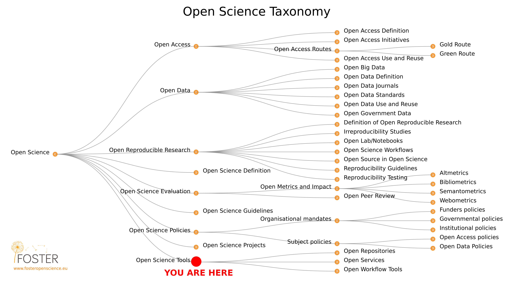
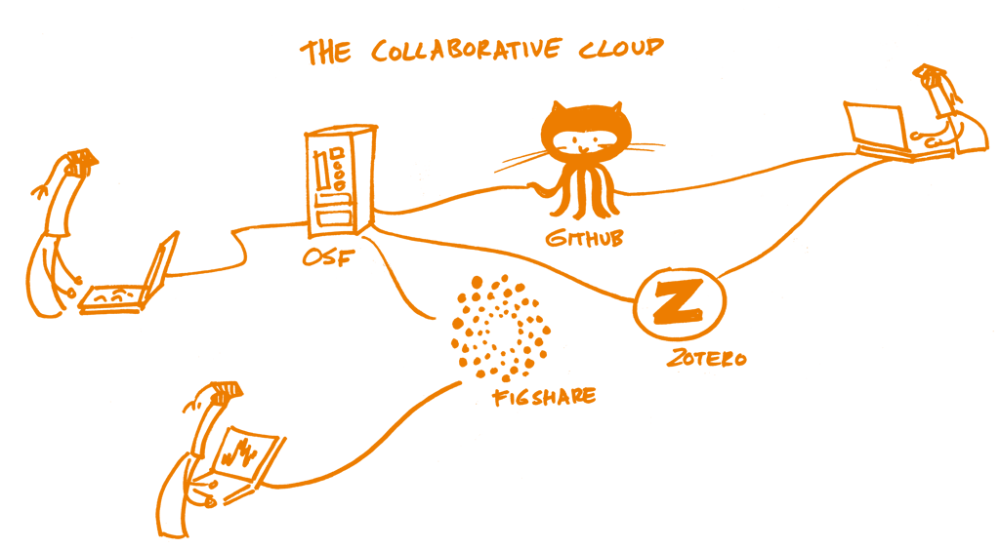
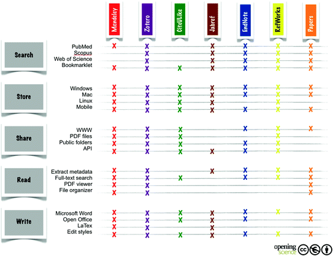

<!-- Markdown emphasis workaround (https://github.com/ramnathv/slidify/issues/224) -->

<!-- Slidify (https://github.com/ramnathv/slidify)
## Install
    library(devtools)
    install_github('ramnathv/slidify')
    install_github('ramnathv/slidifyLibraries')
## Initialize - creates a slide directory, initializes it as a git repo and opens index.Rmd for users to edit
    library(slidify)
    author('OpenScience_2_lecture')
## Author
    Write your presentation in RMarkdown editing the index.Rmd file
## Generate
    slidify('index.Rmd')
## Publish to GitHub
    publish(user = USER, repo = REPO) -->

<!-- Learning objectives (FOSTER):

  Learn what major types of collaborative platforms are available and what the use cases for each might be.

  Learn the advantages of such systems.

  Identify any possible shortcomings of collaborating via such platforms and how to overcome them. -->

## Course roadmap

</img>

[Pontika et al. 2015](https://doi.org/10.1145/2809563.2809571)

--- .class #id
## 7. Collaborative platforms
### Outline

* Definitions
* Rationale
* Summary
* FAQ

<!-- Definitions -->

---{class: [segue, dark]}
## Definitions

---
## e-Research

</img>

[The Open Science Training Handbook](https://book.fosteropenscience.eu/)

--- .class #id
## e-Research

* A _collaborative_ activity that combines the abilities of _distributed_ groups of researchers in order to achieve research goals that would be more difficult to accomplish individually.

* Enables researchers to cooperate, _sharing_ research objects as well and ideas and experiences in multi-disciplinary research projects.

* Enables to _document_ the research process more thoroughly, keeping and curating the resources consumed and generated so that they are discoverable and re-usable by others.

--- .class #id

</img>

[The Open Science Training Handbook](https://book.fosteropenscience.eu/)

--- .class #id
## Collaborative platforms (e-Research ICT tools)

* Virtual research environments (VREs)
  - Open Science Commons (OSF, EOSC)
* Reference management & discovery
* Collaborative coding/writing platforms
* Annotation and review
* Academic social networks

--- .class #id
## Virtual research environments (VREs)

> Virtual  Research  Environments  are  innovative,  web-based,  community oriented,  comprehensive,  flexible,and secure  working  environments  conceived  to  serve  the  needs  of  modern  science. [Candela et al. 2013](https://doi.org/10.2481/dsj.GRDI-013)

* Secure access, using appropriate authentication and authorisation mechanisms to: data resources; large-scale storage facilities; (high performance) computational facilities
* Distributed resources (open and extensible environment)
* (Real-time) Sharing, publishing and archiving of research objects (data sets, analysis methods, workflows, results)
  - workflows automate the process of combining data from a range of different sources and processing it
  - workflows, as machine-executable embodiments of research processes, become research outputs in their own right
  - workflows underpin reproducible research results
* Social networking

\+ Project management and research administration

--- .class #id
## Virtual research environments (VREs)

> The European Commission has funded a range of community-specific VREs under its eInfrastructure funding stream to enable researchers to _collaboratively perform complex tasks such as integrating heterogeneous data from multiple sources, modelling, simulation, data exploration, mining and visualisation_: [The Open Science Training Handbook]()

* VI-SEEM - VRE for regional Interdisciplinary communities in Southeast Europe and the Eastern Mediterranean
* MuG - Multi-Scale Complex Genomics
* VRE4EIC - A Europe-wide Interoperable Virtual Research Environment to Empower Multidisciplinary Research Communities and Accelerate Innovation and Collaboration

---
## Open Science Commons

<q>Digital tools for the creation, dissemination and communication of data, information and knowledge</q>

A new approach for "sharing and governing advanced digital services, scientific instruments, data, knowledge and expertise that enables researchers to _collaborate_ more easily and be more productive". [EGI - Open Science Commons](https://www.egi.eu/open-science-commons/)

---
## European Open Science Cloud (EOSC)

<q>Develop a _trusted_, _virtual_, _federated environment_ that cuts across borders and scientific disciplines to **store**, **share**, **process** and **re-use** research digital objects (like publications, data, and software) following FAIR principles</q> [European Open Science Cloud (EOSC)](https://ec.europa.eu/info/research-and-innovation/strategy/goals-research-and-innovation-policy/open-science/european-open-science-cloud-eosc_en)

---
## Open Science Framework (OSF)

<q>A scholarly commons to connect the entire research cycle</q>

* Searching and discovering publications / data (Google Scholar, ORCiD)
* Designing a research project in a collaborative environment (Google Docs, MENDELEY, zotero)
* Pre-registering ([OSF Preregister](https://osf.io/registries))
* Storing data, code, manuscripts (Dropbox, Google Drive, GitHub)
* Sharing reports, working papers, posters, pre-prints ([OSF Meetings](https://osf.io/meetings), [OSF Preprints](https://osf.io/preprints/), SocArXiV)

---
## Open Science Framework (OSF)

</img> [OSF](https://osf.io/) [Online. Accessed 16 Jun. 2021]

--> [The Open Research Lifecycle | Center for Open Science](https://www.youtube-nocookie.com/embed/9YuNGB3vNOw)

--- .class #id &twocol w1:50% w2:50%
## Collaborative coding/writing platforms

*** =left
</img>

-> Bartling S. (2014) Organizing Collaboration on Scientific Publications: From Email Lists to Cloud Services. In: Bartling S., Friesike S. (eds) Opening Science. Springer, Cham. https://doi.org/10.1007/978-3-319-00026-8_20

*** =right
* [Overleaf](https://www.overleaf.com/): "The easy to use, online, collaborative LaTeX editor."
* [Authorea](https://www.authorea.com/): "Discover and publish cutting edge, open research."
* [Fidus Writer](https://www.fiduswriter.org/): "The all in one solution for collaborative academic writing. Academic citations. Collaborative editing. Multiple publishing solutions. Export as PDF, EPUB or HTML."
* [Google Docs](https://docs.google.com)

---
## Reference management & discovery

* [EndNote](https://endnote.com/) - Proprietary (Thomson Reuters)
* [Mendeley](https://www.mendeley.com) - Proprietary (Elsevier)
* [JabRef](https://www.jabref.org/) - Open Source ~ LaTeX
* [Zotero](https://www.zotero.org/) - Open Source
* [Citavi](https://www.citavi.com/en)

* Web-based: [CiteUlike](https://en.wikipedia.org/wiki/CiteULike), [BibSonomy](https://www.bibsonomy.org/) and [RefWorks](http://www.refworks.com/)

Open bibliographic data formats: BibTeX (.bib)

---
## Reference management & discovery

</img>

[Fenner M., Scheliga K., Bartling S. (2014) Reference Management. In: Bartling S., Friesike S. (eds) Opening Science. Springer, Cham.](https://doi.org/10.1007/978-3-319-00026-8_8)

-> Comparison of reference management software: http://en.wikipedia.org/wiki/Comparison_of_reference_management_software

---
## Annotation and review

Post-publication collaborative review services:

* [PubPeer](https://pubpeer.com) - The overarching goal of the nonprofit PubPeer Foundation is to improve the quality of scientific research by enabling innovative approaches for community interaction.

Collaborative annotation tools:

* [Hypothes.is](https://web.hypothes.is) - Using annotation, enables sentence-level note taking or critique on top of classroom reading, news, blogs, scientific articles, books, terms of service, ballot initiatives, legislation and more.
  - [B. Marwick. How To Do Archaeological Science Using R](https://benmarwick.github.io/How-To-Do-Archaeological-Science-Using-R/)

---
## Academic social networks

* [ResearchGate](https://www.researchgate.net/)
* [Academia.edu](https://www.academia.edu/)
* [Loop](https://www.frontiersin.org/about/loop-research-network) - Loop is Frontiers’ next generation social network for researchers, academics and scholars. We are the only open network that integrates into journals and academic websites. "Our vision is to build an _Open Science platform_ that empowers researchers in their daily work and where everybody has equal opportunity to seek, share and generate knowledge."
  - [Frontiers](https://www.frontiersin.org) is a leading Open Access Publisher and Open Science Platform.

<!-- Rationale -->

---{class: [segue, dark]}
## Rationale

--- .class #id
## What is Open Science?

"The movement to make scientific research (including publications, data, physical samples, and software) and its dissemination accessible to all levels of an inquiring society, amateur or professional. Open science is transparent and accessible knowledge that is **shared and developed through collaborative networks**. It encompasses practices such as publishing open research, campaigning for open access, encouraging scientists to practice open-notebook science, and generally making it easier to publish and communicate scientific knowledge." [Wikipedia Open Science Definition](https://en.wikipedia.org/wiki/Open_science)

"Open Science is the practice of science in such a way that others can **collaborate and contribute**, where research data, lab notes and other research processes are freely available, under terms that enable reuse, redistribution and reproduction of the research and its underlying data and methods." [FOSTER Open Science Definition](https://www.fosteropenscience.eu/foster-taxonomy/open-science-definition)

---
## Archaeological Science is

</img>

[The Open Science Training Handbook](https://book.fosteropenscience.eu/)

---
## E-research is changing Archaeological Science

* Multi- Inter- Cross-disciplinary
* Data science
* Computational science

> Virtual research environments are beginning to change the ways in which researchers go about their work and how they communicate with each other and with other stakeholders such as publishers and service providers. The changes are driven by the changing landscape of data production, curation and (re-)use, by new scientific methods, by changes in technology supply and the increasingly interdisciplinary nature of research in many domains. [Voss & Procter 2009](10.1108/07378830910968146)

---

## Benefits / Opportunites of Collaborative Platforms

> Collaborative working is fundamental to Open Science!

Science is increasingly global, multipolar, and networked. Open Science needs a complex resource system of shared infrastructure and knowledge resources

-> VREs and Open Science Commons enable collaboration across continents, time zones and disciplines.

---
## Shortcomings / Challenges

* Inform researchers, institutions and funders on the effectiveness of these new resources [VREs] as means of communicating, sharing and disseminating research ideas and outputs.
* Advise research institutions and funders about the possible implications of the use of these resources [VREs] for the recognition and reward of research outputs.
* Provide librarians, information professionals and publishers with a view about how they might develop their roles in the scholarly communications process in order to complement the evolution of new means of sharing information in research communities.
* Understand **Open Research** challenges that are likely to play a role in the development of VREs in the foreseeable future.

[Voss & Procter 2009](10.1108/07378830910968146)

---
## A new Digital Dark Age?

* The 'Digital Dark Age' problem refers to the idea that the pace of adoption of new digital technologies canoutstrip the development of the infrastructure required for sustainable access to its outputs, ultimately leading to the loss of data

* The recent rapid uptake of a new wave of new approaches to open data sharing, collaborative web tools and social media has the potential to recreate this
problem.

-> Stuart, J. (2012): A new Digital Dark Age? Collaborative web tools, social media and long-term preservation, World Archaeology, 44:4, 553-570 http://dx.doi.org/10.1080/00438243.2012.737579

<!-- Summary -->

---{class: [segue, dark]}
## Summary

--- .class #id
## Summary

* Introduced collaborative platforms
  - Virtual Research Environments (VREs):
  - Collaborative writing platforms:
  - Reference management & discovery:
  - Annotation and review:
  - Academic social networks: RG and Academia

* Benefits and challenges of collaborative platforms

<!-- FAQ -->

---{class: [segue, dark]}
## FAQ*

--- .class #id

**Why should I add another layer of complexity to my collaboration process? Sharing the doc file is sufficient!**

This is incorrect; although it may seem that you are introducing additional tools and platforms into your usual working approach, they are actually resolving communication issues that you were probably not aware of in the first place. For example, using just a doc file (with or without track changes), only shows the higher level of information and usually only at the tail of the entire scientific process. Working in the context of a collaborative environment, from design to reporting, establishes both clear communication and adequate provenance.

<!-- References & Further resources -->

--- .class #id
## References & further resources
### References

* Bartling S. (2014) Organizing Collaboration on Scientific Publications: From Email Lists to Cloud Services. In: Bartling S., Friesike S. (eds) Opening Science. Springer, Cham. https://doi.org/10.1007/978-3-319-00026-8_20
* Bartling S. (2014) How This Book was Created Using
Collaborative Authoring and Cloud Tools. In: Bartling S., Friesike S. (eds) Opening Science. Springer, Cham. https://doi.org/10.1007/978-3-319-00026-8_24
* Fenner M., Scheliga K., Bartling S. (2014) Reference Management. In: Bartling S., Friesike S. (eds) Opening Science. Springer, Cham. https://doi.org/10.1007/978-3-319-00026-8_8
* Stuart, J. (2012): A new Digital Dark Age? Collaborative web tools, social media and long-term preservation, World Archaeology, 44:4, 553-570 http://dx.doi.org/10.1080/00438243.2012.737579

---
### References

* Candela, L., Castelli, D. and Pagano, P., 2013. Virtual Research Environments: An Overview and a Research Agenda. Data Science Journal, 12, pp.GRDI75–GRDI81. DOI: http://doi.org/10.2481/dsj.GRDI-013
* Voss, A. and Procter, R. (2009), "Virtual research environments in scholarly work and communications", Library Hi Tech, Vol. 27 No. 2, pp. 174-190. https://doi.org/10.1108/07378830910968146
