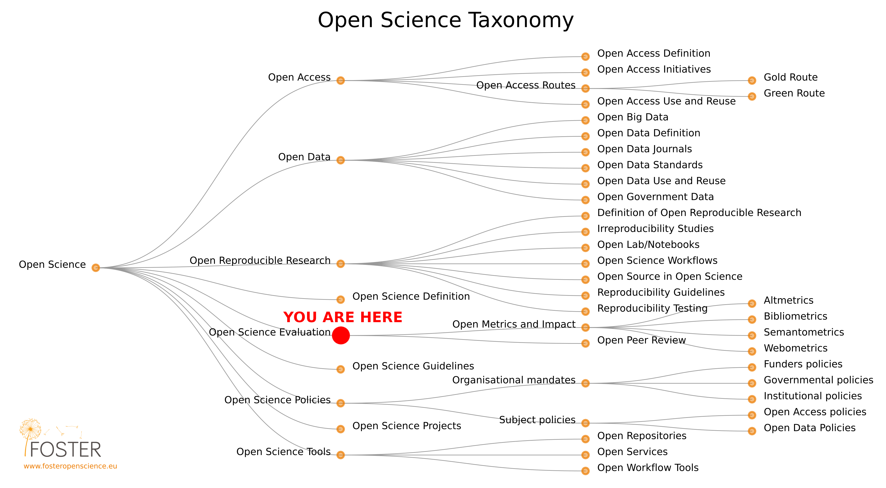
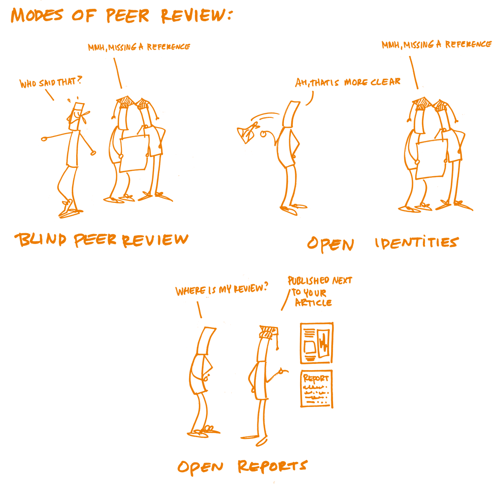

<!-- Markdown emphasis workaround (https://github.com/ramnathv/slidify/issues/224) -->

<!-- Slidify (https://github.com/ramnathv/slidify)
## Install
    library(devtools)
    install_github('ramnathv/slidify')
    install_github('ramnathv/slidifyLibraries')
## Initialize - creates a slide directory, initializes it as a git repo and opens index.Rmd for users to edit
    library(slidify)
    author('OpenScience_2_lecture')
## Author
    Write your presentation in RMarkdown editing the index.Rmd file
## Generate
    slidify('index.Rmd')
## Publish to GitHub
    publish(user = USER, repo = REPO) -->

<!-- Learning objectives (FOSTER):

    Recognise the key elements of open peer review and their potential advantages and disadvantages

    Understand the differences between types of metrics used to assess research and researchers

    Engage with the debate over the way in which evaluation schema affect the ways in which scholarship is performed -->

## Course roadmap

</img>

[Pontika et al. 2015](https://doi.org/10.1145/2809563.2809571)

--- .class #id
## 8. Open Peer Review, Metrics and Evaluation
### Outline

* Peer review
* Metrics
* Summary
* FAQ
* Food for thought

--- .class #id

<q>The act of publishing is a quid pro quo in which authors receive credit and acknowledgment in exchange for disclosure of their scientific findings.</q>

Knowledge is built upon those findings and thus it is necessary to have in place a system to evaluate both research and researchers.

--- .class #id
## Evaluation of Research & Researcher

Both research and researcher are evaluated through two primary methods: **peer review** and **metrics**, the first qualitative and the latter quantitative.

### Peer review
Peer review is used primarily to _judge pieces of research_. It is the formal quality assurance mechanism whereby scholarly manuscripts (e.g., journal articles, books, grant applications and conference papers) are made subject to the scrutiny of others, whose feedback and judgements are then used to improve works and make final decisions regarding selection (for publication, grant allocation or speaking time).

### Metrics
Once they have passed peer review, research publications are then often the primary _measure of a researcher's work_ ('Publish or Perish'). [...] However, assessing the quality of publications is difficult and subjective. [...] General assessment is often based on metrics such as the number of citations publications garner (_h_-index), or even the perceived level of prestige of the journal it was published in (quantified by the Journal Impact Factor).

<!-- Peer review -->

---{class: [segue, dark]}
## Peer review

--- .class #id
## The Peer Review System

<q>The peer review system judges the _validity_, _significance_ and _originality_ of the work, **rather than who has done it**.</q>

[VoYS. Peer review. The nuts and bolts. A guide for early career researchers](https://senseaboutscience.org/wp-content/uploads/2016/09/peer-review-the-nuts-and-bolts.pdf)

--- .class #id
## The (Traditional) Peer Review Process

</img>

[VoYS. Peer review. The nuts and bolts. A guide for early career researchers](https://senseaboutscience.org/wp-content/uploads/2016/09/peer-review-the-nuts-and-bolts.pdf)

--- .class #id
## History of Peer Review

* "Referee systems are not as old as historical accounts often claim. Investigators of nature communicated their findings without scientific referees for centuries. Deciding whom and what to trust usually depended on personal knowledge among close-knit groups of researchers".
* "The first referee systems that we would recognize as such were set in place by English scientific societies in the early nineteenth century".
* "The notion [of referees as supreme scientific gatekeepers] emerged in around 1900. It was exactly then that some began to wonder whether referee systems might be fundamentally flawed. In this sense, **peer review has always been broken**".

[Csiszar 2016](https://doi.org/10.1038/532306a)

--- .class #id
## Problems with (Traditional) Peer Review

* **Unreliability and inconsistency**: Reliant upon the vagaries of human judgement, the objectivity, reliability, and consistency of peer review are subject to question.
* **Delay and expense**: The period from submission to publication at many journals can often exceed one year, with much of this time taken up by peer review.
* **Lack of accountability and risks of subversion**: The “black-box” nature of traditional peer review gives reviewers, editors and even authors a lot of power to potentially subvert the process.
* **Social and publication biases**: Peer reviewers may be subject to social biases on the grounds of gender, nationality, institutional affiliation, language and discipline
* **Lack of incentives**: Traditional peer review provides little in the way of incentives for reviewers, whose work is almost exclusively unpaid and whose anonymous contributions cannot be recognised and hence rewarded
* **Wastefulness**: Potentially valuable additional information (Reviewer comments & disagreements, Authors replies) is wasted.

[Ross-Hellauer 2017](https://doi.org/10/gc5sjh)

--- .class #id

</img>

[The Open Science Training Handbook](https://book.fosteropenscience.eu/)

--- .class #id &twocol w1:50% w2:50%
## Modes of Peer Review

*** =left
### SINGLE-BLIND REVIEW

The <u>_reviewers know_</u> who the authors are, but the <u>_authors do not know_</u> who the reviewers are. The most common system in science disciplines.
  - This allows reviewers to provide honest, critical reviews and opinions without fear of reprisal from the authors.
  - **Lack of accountability**, allows unscrupulous reviewers to submit **unwarranted negative reviews**, **delay** the review process and steal ideas.

*** =right
### DOUBLE-BLIND REVIEW

The <u>_reviewers do not know_</u> who the authors are, and the <u>_authors do not know_</u> who the reviewers are. Main form of peer review used in the humanities and social sciences.
  - Reduces possible bias resulting from knowing who the authors are or where they come from, work assessed on its own merits.
  - Involves some effort to make sure manuscripts are anonymized. Information important for a complete critical appraisal is missing.

--- .class #id
## Modes of Peer Review

### OPEN PEER REVIEW

At its most basic (Open identities), <u>_reviewers know_</u> who the authors are and the <u>_authors know_</u> who the reviewers are. It can also mean inclusion of the _reviewers’ names_ and/or _reports_ alongside the published paper (Open reports), _comments_ from others at pre-publication stage, or various combinations of these.
  - **Greater accountability** and reduced opportunity for bias or inappropriate actions. Reviewers can be given **public credit** for their work.
  - Potential reviewers may be more likely to decline to review. Revealing reviewer identity may lead to animosity from authors, damaged relationships and repercussions for job prospects, promotion and grant funding.

--- .class #id
## Open Peer Review

> An umbrella term for a number of overlapping ways that peer review models can be adapted in line with the aims of Open Science. [Ross-Hellauer 2017](https://doi.org/10/gc5sjh)

Main traits (combined, or not):

* **Open identities** - where both authors and reviewers are aware of each other’s identities (i.e., non-blinded)
* **Open reports** - where review reports are published alongside the relevant article.

--- .class #id
## Open Peer Review

> An umbrella term for a number of overlapping ways that peer review models can be adapted in line with the aims of Open Science. [Ross-Hellauer 2017](https://doi.org/10/gc5sjh)

Optional traits:

* **Open participation** - where members of the wider community are able to contribute to the review process
* **Open interaction** - where direct reciprocal discussion between author(s) and reviewers, and/or between reviewers, is allowed and encouraged
* **Open pre-review manuscripts** - where manuscripts are made immediately available in advance of any formal peer review procedures
* **Open final-version commenting**: Review or commenting on final “version of record” publications.
* **Open platforms (“decoupled review”)**: Review is facilitated by a different organizational entity than the venue of publication.

--- .class #id
## Open Peer Review Example
### Nature

</img>

* Leder, D., Hermann, R., Hüls, M. et al. A 51,000-year-old engraved bone reveals Neanderthals’ capacity for symbolic behaviour. Nat Ecol Evol (2021). https://doi.org/10.1038/s41559-021-01487-z

--- .class #id
## Open Peer Review Example
### F1000

</img>

* [Ross-Hellauer 2017](https://doi.org/10/gc5sjh)

--- .class #id
## Open Peer Review Example
### Peer Community In (PCI)

<iframe src="https://www.youtube.com/embed/4PZhpnc8wwo" width="640" height="360" title="YouTube video player" frameborder="0" allow="accelerometer; autoplay; clipboard-write; encrypted-media; gyroscope; picture-in-picture" allowfullscreen></iframe>

---
## Open Research Europe

</img>

[Open Research Europe](https://open-research-europe.ec.europa.eu/about)

--- .class #id
## Problems with (Traditional) Peer Review

* ~~**Unreliability and inconsistency**~~: _Open identities_ and _open reports_ are theorized to lead to better reviews.
* ~~**Delay and expense**~~: _Open pre-review manuscripts_ sharply reduce the time before research is first publicly available and may increase the overall quality of initial submissions.
* ~~**Lack of accountability and risks of subversion**~~: _Open identities_ and _reports_ can increase accountability through increased transparency and by making any conflicts of interest more immediately apparent to authors and future readers.
* ~~**Social and publication biases**~~: _Open reports_ adds another layer of quality assurance, allowing the wider community to scrutinize reviews.
* ~~**Lack of incentives**~~: _Open reports_ linked to _open identities_ enable higher visibility for peer review activities.
* ~~**Wastefulness**~~: _Open reports_ make currently invisible but potentially useful scholarly information available for re-use, as well as providing young researchers a guide.

[Ross-Hellauer 2017](https://doi.org/10/gc5sjh)

--- .class #id
## Advantages of Open Peer Review

* _Open identities_ fosters **greater accountability** amongst reviewers and reduces the opportunities for bias or undisclosed conflicts of interest.
* _Open reports_ add another layer of **quality assurance**, allowing the wider community to scrutinize reviews to examine decision-making processes.
* In combination, _open identities_ and _open reports_ are theorized to lead to **better reviews**, as the thought of having their name publicly connected to a work or seeing their review published encourages reviewers to be more thorough.
* _Open identities_ and _open reports_ enable reviewers to gain **public credit** for their review work, thus incentivising this vital activity and allowing review work to be cited in other publications and in career development activities linked to promotion and tenure.
* _Open participation_ could overcome problems associated with editorial selection of reviewers (e.g., biases, closed-networks, elitism). Especially for early career researchers who do not yet receive invitations to review, such open processes may also present a chance to build their research reputation and practice their review skills.

--- .class #id
## Advantages of Open Peer Review

> Being a peer reviewer presents researchers with opportunities for engaging with novel research, building academic networks and expertise, and refining their own writing skills. It is a crucial element of quality control for academic work. Yet, in general, researchers do not often receive formal training in how to do peer review. Even where researchers believe themselves confident with traditional peer review, however, the many forms of open peer review present new challenges and opportunities.

<q>Open peer review hence aims to bring greater **transparency**, **accountability**, **inclusivity** and/or **efficiency** to the restricted model of traditional peer review.</q>

--- .class #id
## Disadvantages of Open Peer-review

* **Social biases** - _Open identities removes anonymity conditions_ for reviewers (single-blind) or authors and reviewers (double-blind) which are traditionally in place to counteract social biases - status, history, or affiliations of the author(s) might influence the reviewers' judgements (e.g., by discouraging reviewers from making strong criticisms, especially against higher-status colleagues).
  - Reviewers should constantly question their assumptions to ensure their judgements reflect only the quality of the manuscript, and not the status, history, or affiliations of the author(s).
* **Subjectivity** - Authors and reviewers may subjectively agree or disagree on how to present the results and/or what needs improvement, amendment or correction. In open identities and/or open reports, the _transparency could exacerbate such differences_ and the difficulties to manage emotional reactions.

> Given these issues, potential reviewers may be more likely to decline to review.

<!-- Metrics -->

---{class: [segue, dark]}
## Metrics

---
## Citation Indices

> Metrics have proliferated: usually well intentioned, not always well informed, often ill applied. [Hicks et al 2015. Bibliometrics: The Leiden Manifesto for research metrics](http://www.nature.com/news/bibliometrics-the-leiden-manifesto-for-research-metrics-1.17351)

* Science Citation Index (Institute for Scientific Information), before 2000
* [Web of Science](https://www.webofknowledge.com) (Thomson Reuters), 2002
* [Scopus](https://www.elsevier.com/solutions/scopus?dgcid=RN_AGCM_Sourced_300005030) (Elsevier), 2004
* [Google Scholar](https://scholar.google.com/) (Google), 2004
* _h_-index (J. Hirsch, University of California, San Diego), 2005

Metrics related to social usage and online comment:

* F1000Prime, 2002
* Mendeley, 2008
* [Altmetric.com](https://www.altmetric.com/) (supported by Macmillan Science and Education, which owns Nature Publishing Group), 2011

---
## The _h_-index/Impact-factor/Ranking Obsession

* **_h_-index**
> Some recruiters request h-index values for candidates. Several universities base promotion decisions on threshold h-index values and on the number of articles in 'high-impact' journals. Researchers' CVs have become opportunities to boast about these scores, notably in biomedicine. Everywhere, supervisors ask PhD students to publish in high-impact journals and acquire external funding before they are ready. [Hicks et al 2015. Bibliometrics: The Leiden Manifesto for research metrics](http://www.nature.com/news/bibliometrics-the-leiden-manifesto-for-research-metrics-1.17351)

* **Impact factor**
> The Journal Impact Factor is frequently used as the primary parameter with which to compare the scientific output of individuals and institutions. The Journal Impact Factor, as calculated by Thomson Reuters, was originally created as a tool to help librarians identify journals to purchase, not as a measure of the scientific quality of research in an article. With that in mind, it is critical to understand that the Journal Impact Factor has a number of well-documented deficiencies as a tool for research assessment. [DORA](https://sfdora.org/)

* Across the world, universities have become obsessed with their position in **global rankings** (such as the Shanghai Ranking and Times Higher Education's list)

---
## Problems with Metrics

* A myriad of metrics is available, compounded by many similar versions of the same metric.

* The commercial systems and tools available have not effectively addressed all the needs of a university.

* Difficult to know which metric will give the most useful insights, whether a metric is being calculated appropriately, and whether other institutions are looking at things in the same way.

* The metrics used to evaluate research (e.g. Journal Impact Factor, h-index) do not measure - and therefore do not reward - open research practices. Open peer review activity is not necessarily recognized as "scholarship". Furthermore, many evaluation metrics - especially certain types of bibliometrics - are not as open and transparent as the community would like.

---
## The Leiden Manifesto for research metrics

10 principles for the measurement of research performance, against the pervasive misapplication of indicators to the evaluation of scientific performance.

* [Leiden manifesto](http://www.leidenmanifesto.org/)
* [Hicks, Wouters, Waltman, de Rijcke, Rafols, Nature, April 23, 2015](http://www.nature.com/news/bibliometrics-the-leiden-manifesto-for-research-metrics-1.17351)

---
## The Leiden Manifesto for research metrics

<iframe src="https://player.vimeo.com/video/133683418" width="640" height="360" frameborder="0" allow="autoplay; fullscreen; picture-in-picture" allowfullscreen></iframe>

<a href="https://vimeo.com/133683418">The Leiden Manifesto for Research Metrics</a> from <a href="https://vimeo.com/user22496098">Diana Hicks</a> on <a href="https://vimeo.com">Vimeo</a>.

---
## Declaration on Research Assessment (DORA)

> DORA recognizes the **need to improve the ways in which the outputs of scholarly research are evaluated**. The declaration was developed in 2012 during the Annual Meeting of the American Society for Cell Biology in San Francisco. It has become a worldwide initiative covering all scholarly disciplines and all key stakeholders including funders, publishers, professional societies, institutions, and researchers. We encourage all individuals and organizations who are interested in developing and promoting best practice in the assessment of scholarly research to sign DORA. [DORA](https://sfdora.org/)

The Journal Impact Factor has a number of well-documented deficiencies as a tool for research assessment:

* Citation distributions within journals are highly skewed
* The properties of the Journal Impact Factor are field-specific: it is a composite of multiple, highly diverse article types, including primary research papers and reviews
* Journal Impact Factors can be manipulated (or “gamed”) by editorial policy
* Data used to calculate the Journal Impact Factors are neither transparent nor openly available to the public

---
## Declaration on Research Assessment (DORA)

* The need to <u>_eliminate the use of journal-based metrics_</u>, such as Journal Impact Factors, in funding, appointment, and promotion considerations
* The need to <u>_assess research on its own merits_</u> rather than on the basis of the journal in which the research is published
* The need to <u>_capitalize on the opportunities provided by online publication_</u>, such as relaxing unnecessary limits on the number of words, figures, and references in articles, and exploring new indicators of significance and impact.

Objectives:

* **Raise awareness** - on new tools and processes in research assessment and the responsible use of metrics that align with core academic values and promote consistency and transparency in decision-making
* **Facilitate implementation** - by developing new policies and practices
* **Catalyze change** - by working across scholarly disciplines and globally
* **Improve equity** - and the broader representation of researchers in the design of research assessment practices

---
## Altmetrics

A single research output may live online in multiple websites and can be talked about across dozens of different platforms.

> Altmetrics are metrics and qualitative data that are complementary to traditional, citation-based metrics. They can include (but are not limited to) peer reviews on _Faculty of 1000_, citations on _Wikipedia_ and in _public policy documents_, discussions on research _blogs_, _mainstream_ media coverage, bookmarks on _reference managers_ like Mendeley, and mentions on _social networks_ such as Twitter. 

</img>

Other Altmetrics services: [Paperbuzz](https://paperbuzz.org/) [Impactstory](https://profiles.impactstory.org/) [Dimensions.ai](https://www.dimensions.ai/) [PlumX Metrics](https://plumanalytics.com/learn/about-metrics/) [Snowball Metrics](https://snowballmetrics.com/)

--- .class #id &twocol w1:50% w2:50%
## Altmetrics

*** =left
### Benefits

* They accumulate quicker than citations
* They can gauge the impact of research outputs other than journal publications
* They can provide diverse measures of impact for individual objects
* The timeliness of altmetrics presents a particular advantage to early-career researchers
* Altmetrics can help with early identification of influential research and potential connections between researchers

*** =right
### Challenges

* Lack of robustness and susceptibility to ‘gaming’
* That any measure ceases to be a good measure once it becomes a target (‘Goodhart’s Law’)
* Relative lack of social media uptake in some disciplines and geographical regions
* A reliance on commercial entities for the underlying data

---
## Future directions

A recent report from the European Commission (2017) recognizes that there are basically two approaches to Open Science implementation and the way rewards and evaluation can support that:

* Simply support the status quo by **encouraging more openness, building related metrics and quantifying outputs**;

* **Experiment with alternative research practices and assessment, open data, citizen science and open education**.

More and more funders and institutions are taking steps in these directions.

Other steps funders are taking: allowing more types of research output (such as preprints) in applications and funding different types of research (such as replication studies).

--- .class #id

</img>

[Curry 2019](https://indico.cern.ch/event/786048/contributions/3361107/attachments/1866423/3069233/190620-OAI-DORA.pdf) [Online access, 16 Jul '21]

<!-- Summary -->

---{class: [segue, dark]}
## Summary

--- .class #id
## Summary

* Problems with the traditional peer review system
* Definition of Open peer review
* Advantages and disadvantages of Open peer review
* Metrics (citation indexes, impact factor)
* Problems with metrics and (Leiden Manifesto, DORA)
* Alternatives metrics
* Future direction of the EC / The 'Open Research Europe' platform

<!-- FAQ -->

---{class: [segue, dark]}
## FAQ*

--- .class #id
**Is research evaluation fair?**

Research evaluation is as fair as its methods and evaluation techniques. Metrics and altmetrics try to measure research quality with research output quantity, which can be accurate, but does not have to be.

<!-- Food for thought -->

--- .class #id
## Food for thought

> Science is a method whereby a notion proffered by anyone must be supported by experimental data. This means that if somebody else is interested in checking up on the notion presented, that person must be allowed access to instructions as to how the original experiments were done. Then he can check things out for himself. It is not allowable in science to make a statement of fact based solely on your own opinion.

> _Claims made by scientists, in contrast to those made by movie critics or theologians, can be separated from the scientists who make them._ It isn’t important to know who Issac Newton was. He discovered that force is equal to mass times acceleration. He was an antisocial, crazy person who wanted to burn down his parents’ house. But force is still equal to mass times acceleration. It can be demonstrated by anybody with a pool table and familiar with Newton's concepts. [K. Mullis, 1998, Dancing naked in the mind field](https://openlibrary.org/books/OL18318494M/Dancing_naked_in_the_mind_field)

However, social biases seem to be well rooted in such a 'prestige economy'.

<!-- References & Further resources -->

--- .class #id
## References & further resources

### References

* Csiszar, A. Peer review: Troubled from the start. Nature 532, 306–308 (2016). https://doi.org/10.1038/532306a
* Hicks, Wouters, Waltman, de Rijcke, Rafols, Nature, April 23, 2015 http://www.nature.com/news/bibliometrics-the-leiden-manifesto-for-research-metrics-1.17351)

### Further resources

* Blackmore, P., & Kandiko, C. B. (2011). Motivation in academic life: a prestige economy. Research in Post-Compulsory Education, 16(4), 399–411. https://doi.org/doi:10.1080/13596748.2011.626971
* Directorate-General for Research and Innovation (European Commission): Evaluation of Research Careers Fully Acknowledging Open Science Practices: Rewards, Incentives and/or Recognition for Researchers Practicing Open Science. Report, 14 November 2017: https://doi.org/10.2777/75255
